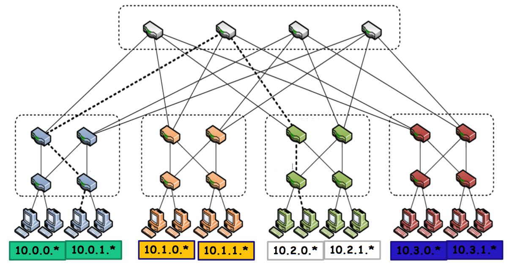

- 考试内容为L01-L06，L09-L11的ppt。40道选择题。

### 复习要点

#### 云计算的五大基本特征

- 按需自助服务
  自动化资源分配
- 宽带网络访问
  Location independent
- 资源池化（集中）
  多租户模式
- 快速伸缩
  资源快速分配和释放
- 可计量
  Pay-as-you-go

#### 云计算的核心理念

- 虚拟化：
  提供池化资源和按需服务
- 多租户
  节省开发和维护的成本
- 数据中心
  提供基础设施和安全保障

#### 云计算的模式

- 软件即服务：SaaS
- 平台即服务：PaaS
- 基础结构即服务：IaaS

- 无服务器计算 Serverless
  - BaaS：Backend as a Service
  - FaaS：Function as a Service

#### 云计算面临的挑战

- 技术挑战
  - 数据远距离传输代价昂贵
  - 数据安全和隐私
    - 数据的所有权
    - 不安全的接口、数据丢失√黑客攻击
  - 数据中心能耗
- 非技术挑战
  - 越来越多的安全漏洞
    - 数据共享的安全风险
    - 资源共享的安全风险
  - 不同云平台之间缺乏可移植性
    - Vendor lock--in（供应商锁定）
  - 多区域合规和法律问题
    - 不同地区的数据中心受不同数据政策的约束

#### 覆盖网络

- 构建在原有网络之上的计算机网络
  - 下层称为底层网络
  - 上层称为覆盖网络，由众多物理节点和链路构成虚拟链路
  - 其目的是对底层网络进行逻辑重构、从而方便网络节点在相应的应用中通信

#### 封装与隧道

- 隧道协议
  - 使用一种网络协议将另一个网络协议封装在负载部分
  - 使得数据可以在不兼容的网络上传输，或在不安全网络上提供一个安全的路径（例：VPN）
  - 常见的隧道协议 IPSec、GRE、SSH、SOCKS
  - 隧道协议往往伴随数据加密技术
- 覆盖网络的本质上是使用封装技术，在原有网络的基础上构建的隧道网络
#### 能源效率
- Power Usage Effectiveness（PUE）
- PUE=数据中心全部能耗/IT设备的能耗
- 衡量冷却、照明、电力等非IT设备的开销比率
- PUE=1/（0.42+0.117+0.143+0.049）=1.37

#### 三层架构

- Access Layer （TOR层）
  - 接入交换机通常位于机架顶部，所以它们也被称为ToR（Top of Rack）交换机，它们物理连接服务器。
- Aggregation layer
  - 汇聚交换机连接接入交换机，同时提供其他的服务，例如：防火墙，SSL Offload，入侵检测，网络分析等。
- Core Layer
  - 核心交换机为进出数据中心的包提供高速的转发，为多个汇聚层提供连接性，核心交换机为整个网络提供一个弹性的 L3 路由网络。

#### Fat Tree 结构

自上而下分别为边缘层（edge）、汇聚层（aggregate）和核心层（core），其中汇聚层交换机与边缘层交换机构成一个pod。

FatTree构建拓扑规则如下：FatTree拓扑中包含的Pod数目为 k，每一个pod连接的sever数目为$(k/2)^2$，每一个pod内的边缘交换机及聚合交换机数量均为k/2，核心交换机数量为$(k/2)^2$，网络中每一个交换机的端口数量为k，网络所能支持的服务器总数为$k^3/4$。

- 容纳$k\times(k/2)^2$个服务器
- 需要$k\times k+(k/2)^2$台交换机

#### 云计算的资源组织架构
- 工作负载分配架构
- 资源池化架构
- 动态可扩展架构
- 弹性资源容量架构
- 服务负载平衡架构
- 云爆发架构
- 弹性磁盘供应架构
- 冗余存储架构

#### 部署云应用程序的优势

- 低成本：有限的基础设施投入
- 便利：应用程序开发人员无需关心后台系统的搭建和运维
- 性能优势
  - 根据工作负载弹性伸缩云资源
  - 应用程序可以将工作负载分成N份并行处理，理论上处理时间将缩短N倍
- 可靠和安全：云安全技术保障数据安全和业务连续性
- 多租户架构
  - 降低应用程序的运维开销
  - 提高云资源的利用率
- 按需付费（pay-as-you-go）定价模式：根据资源使用量付费，降低不必要开销
#### 阿达姆定律
假设s为并行处理实例个数，p为工作负载中可以并行处理的部分，则理论加速比为
$$
Speedup(s)=\frac{1}{(1-p)+p/s}
$$

#### 云原生的基本内容/四大特征
  包含应用程序开发的技术和管理两部分（四个基本特征）

- 敏捷基础设施
  - 随时使用
  - 弹性、按需
  - 以容器技术实现
- 微服务
  - 只做一件事的独立小应用
  - 可以独立扩展、升级和替换
  - 解决传统单体服务架构臃肿、迭代速度慢、单点瓶颈导致业务瘫痪等问题
- 持续集成持续交付（CI/CD）
  - 流水线开发方法
  - 持续集成：开发人员每次提交改动，立刻进行产品自动化测试
  - 持续交付：持续集成完成后，应用程序能够达到生产的条件，自动提交到预发布系统上
- DevOps
  - Dev（开发人员）+Ops（运维人员）

#### AWS计算：Lambda

- 事件驱动的无服务器计算（ServerlessComputing）平台
  - 以响应事件的方式运行代码
  - 自动管理代码运行所需要的资源
  - 支持Node.js, Python, Java, Go, Ruby和C#等