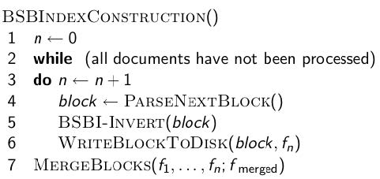
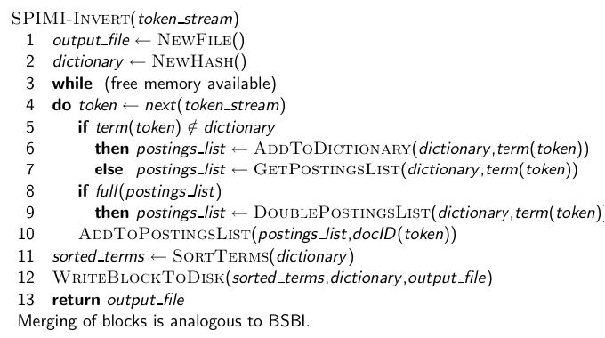
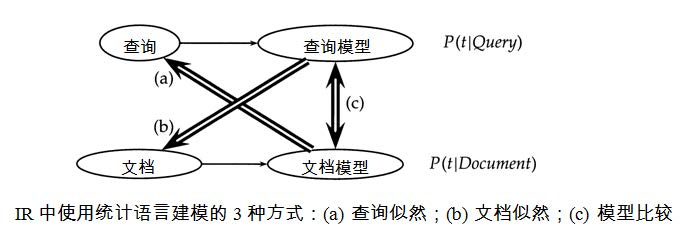

## 2020-2021 信息检索复习提纲

### 综述

80基础+20拓展

1. 布尔模型，向量模型，概率模型，语言模型
2. 相关反馈和查询扩展
3. 文本处理 的步骤
4. 文本分类的技术
5. 检索系统的评价指标，每种方法的特点，优缺点

题型：计算，填空，选择题

### L0&L1 布尔检索

1. **什么是信息检索**，应用场景

   - 信息检索：
     - 给定用户需求返回满足该需求信息的一门学科
     - 信息检索是从大规模非结构化数据的集合中，找出满足用户信息需求的资料的过程。
     - 通常涉及信息的获取、存储、组织和访问。
   - 应用场景
     - 搜索
     - 舆情分析
     - 推荐
     - 内容安全
     - 数据挖掘
     - 情报处理

2. **传统与现在的差异**

   传统信息检索主要关注非结构化、半结构化数据；现代信息检索中也处理结构化数据

3. 正确率和召回率

   - 正确率(PRECISION)：返回结果文档中正确的比例
   - 召回率(RECALL) : 全部相关文档中被返回的比例

4. **倒排索引的构建**，结构，组织。

   1.  为什么包含这一项
   2. posting list 为什么按序
   3. 构建过程
   4. and 从小开始合并
   5. O（m+n）
   6. 转化成合取范式

5. 布尔检索的优缺点

   - 优点
     - 构建简单
     - 明确检索内容和返回结果的关系
   - 缺点
     - 布尔查询构建复杂，不适合普通用户。构建不当，检索结果过多或者过少
     - 没有充分利用词项的频率信息
     - 不能对检索结果进行排序
   
6. 中英文在构建索引时的区别

   1. 分词
   2. 词汇粒度
   3. 大小写
   4. 连字符 “-”
   5. 专有词
   6. 语态变化
   7. 语素和偏旁的使用
   8. 歧义问题

#### 倒排索引

- 倒排索引的构建
  1. 将文档 tokenizer 词条化，成为<词条，DOCID>二元组
  2. 利用语言分析工具将词条转化为词项，成为<词项，DOCID>二元组
  3. 按词项进行排序
  4. 每个词项按docID排序
  5. 某个词项在单篇文档中的多次出现会被合并 
  6. 拆分成词典和倒排记录表两部分，组成 <词项，frequency> -> posting list
- 为什么记录frequency：进行and操作时，有限对词频小的进行操作，提高效率
- posting list为什么按序：布尔操作（and/or）时，加快合并效率，提高到O(m+n)
- 通用策略：将布尔表达式转换成合取范式

### L2 词汇表和倒排记录表

1. 词条和词项

   - 词条：是一个字符串在文档中出现的实例，出现多次算多个词条
   - 词项：经过处理的词条，词项就是我们最终要索引的对象

2. 词条化需要注意的问题

   - 词之间的边界是什么？空格？撇号还是连接符
     - 复合词(如state-of-the-art)算一个词还是多个词
     - New York算一个词条还是两个词条
   - 数字、日期、电话如何处理
   - 专有名词
   - 法语德语中连写
   - 中文、日文的分词

3. 搜索引擎中的分词方法
   1. 基于词典：字符串匹配（正向最大匹配法、逆向最大匹配法、双向最大匹配法等）
   2. 基于统计的：对语料中相邻共现的各个字的组合的频度进行统计，计算它们的互现信息，计算共现概率
   3. 基于启发式规则的

4. 停用词

   根据停用词表(stop list), 将那些最常见的词从词典中去掉

5. 词条的归一化：将文档和查询中的词归一化成同一形式

   - 大小写问题：可以将所有字母转换成小写形式，但不适用于所有情况
   - 非对称扩展
   - 同义词和同音/同形异义词
     - 建立词典，记录词对(car = automobile等)
     - soundex方法
   - 词形归并(Lemmatization)：将单词的屈折变体形式还原为原形
     - am, are, is  -->  be
   - 词干还原（Stemming）：将词项归约(reduce)成其词干(stem)，然后再索引
     - Porter算法

6. 拼写错误问题：soundex 、词干还原（了解概念）

7. Potter不考

8. **跳表法** 

   1. 为什么可以加快速度：可以跳过那些不可能的检索结果
   2. 步长对检索的影响
      1. 步长越短：更容易跳转，但是需要更多的与跳表指针指向记录的比较
      2. 步长越长：成功跳转的次数少
   3. 如何选择步长：
      - 启发式策略：对于长度为L的倒排记录表，每$\sqrt{L}$处放一个跳表指针。但是如果索引经常更新造成L经常变化，均匀方式方式就很不方便

9. **支持短语查询的方法**

   1. 双词索引：每两个连续的词组成词对(作为短语)来索引
   2. 扩展的双词索引：标注词性，更好表达语义
   3. 带位置信息的索引：在倒排记录表中，对每个term在每篇文档中的每个位置(偏移或者单词序号)进行存储。
      - 基于位置信息索引，能够处理短语查询(phrase query)，也能处理邻近式查询

10. 类似题：你认为中文处理和英文处理有什么区别

### L3 词典及容错式检索

1. 通配符查询是怎么支持的
   1. 使用树结构，范围查询
   2. 轮排索引的构建
2. 哈希表的优缺点
   - 优点：
     - 哈希表中的定位速度快于树中的定位速度：查询时间是常数
   - 缺点：
     - 没办法处理词项的微小变形
     - 不支持前缀搜索
     - 如果词汇表不断增大，需要定期对所有词项重新哈希
3. 树的优缺点
   - 优点
     - 支持前缀查找
     - 支持范围查询
   - 缺点
     - 搜索速度略低于哈希表方式：O(logM)
4. 不考k-gram
5. 基于编辑距离的拼写校正的两种方法
   1. 编辑距离(Levenshtein距离)
      - 从字符串$s_1$转换成$s_2$的最少的操作数目
      - 基本操作：插入、删除、替换
   2. Damerau-Levenshtein
      - 加上字符交换的编辑距离
   3. 带权重的编辑距离
      - 利用键盘位置赋予错误权重
6. 基于k-gram索引的拼写校正：比轮排索引空间开销小
7. Soundex：将词典中每个词项转换成一个4字符缩减形式
   - 适用于“高召回率”任务 

### L4 索引构建

1. BSBI算法：基于块的排序索引构建算法

   1. 对每个块: 

      (i) 倒排记录累积到10,000,000条,

      (ii) 将词项映射termid

      (iii) 在内存中排序

      (iv) 写回磁盘

   2. 最后将所有的块合并成一个大的有序的倒排索引

   

   3.  为什么将term映射为termid，又会有什么问题
      1. 排序
      2. 全局统一ID
      3. 省空间
      4. 内存中必须能够存下映射词典

2. SPIMI：内存式单遍扫描索引构建算法 Single-pass in-memory indexing

   1. 对每个块都产生一个独立的词典–不需要在块之间进行term-termID的映射
   2. 对倒排记录表不排序，按照他们出现的先后顺序排列
   3. 这些独立的索引最后合并一个大索引
   4. 如果使用压缩，SPIMI将更加高效

   

3. 动态索引构建

   主索引（磁盘） + 辅助索引（内存）；同时搜索两个索引，然后合并结果，定期将辅助索引合并到主索引中

### L5 索引压缩

1. 为什么要进行索引压缩

   1. 减少磁盘空间
   2. 增加内存存储内容
   3. 加快从磁盘到内存的数据传输速度

   对于词典的压缩，使之能够尽量放入内存中；对于倒排记录表的压缩，减少磁盘存储空间，减少从磁盘读入内存的时间

2. **索引压缩有哪些方法**

   - 词典压缩
     - Dictionary as a string
     - 单一字符串方式下按块存储
     - 前端编码
   - 倒排记录表压缩
     - 存储docID间隔（罕见词和常见词，间隔大小差别非常大）
     - 变长编码

3. 说明zipf定律是什么，并举例

   - Zipf定律:  第i常见的词项的文档集频率$cf_i$ 和$\frac{1}{i}$ 成正比
     $$
     cf_i\propto\frac{1}{i}
     $$

     - $cf_i$：词项$t_i$在所有文档出现的次数

   - 举例

     - 80%的财富集中在20%的人手中
     - 80%的用户只使用20%的功能
     - 20%的用户贡献了80%的访问量

4. dictionary as string的过程

   1. 将整部词典看成单一字符串
   2. 将原有存储词项改为存储词项指针，指向字符串的某个位置

5. 单一字符串方式下按块存储

   1. 每x个词项组成一个块，每个块只存储一个词项指针；
   2. 词典字符串增加存储每个单词的长度，如 1a2an3the3zzz

6. 前端压缩

   1. 公共前缀

7. postinglist的压缩：差值表示，变长编码 **估计不考**

### L6 文档评分、词项权重计算及向量空间模型

1. 为什么进行排序

   - 排序式检索可以避免产生过多或者过少的结果
   - 使相关度高的结果优先被看到

2. Jaccard系数，**不足**

   1. 令A和B为两个集合，在信息检索中，A为查询q，B为文档d
      $$
      Jaccard(A,B)=\frac{|A\cap B|}{|A\cup B|}
      $$

   2. 缺点

      - 没有考虑词项频率
      - 罕见词比高频词的信息量更大，Jaccard系数没有考虑这个信息
      - 没有仔细考虑文档的长度因素

3. 什么是词袋模型，缺点？

   - 词袋模型：不考虑词在文档中出现的顺序，只考虑词项频率
   - 缺点：
     - 没有考虑位置信息

4. tf-idf 

   1. tf：$tf_{t,d}$词项t在文档d中出现的次数
   2. 对数词频:$w_{t,d}=1+log_{10}tf_{t,d}$  if $tf_{t,d}>0$
   3. df：文档频率，出现词项的文档数目
   4. cf：文档集频率 
   5. $idf_t=log_{10}\dfrac{N}{df_t}$
   6. 为什么要有idf
      1. 对于罕见词项我们希望赋予高权重
      2. 对于常见词我们希望赋予正的低权重
   7. $tf-idf=(1+logtf_{t,d})log_{10}\dfrac{N}{df_t}$
   8. tf，df，cf的关系

5. 向量空间模型怎么进行查询
   1. cos相似度
      $$
      cos(q,d)=\dfrac{q\cdot d}{|q||d|}
      $$
   
2. **文档长度归一化，为什么**：长文档和短文档的向量中的权重都处于同一数量级
   
   3. 为什么不使用欧式距离/进行归一化：可能出现两个文档相似，但欧式距离很大

### L7 评分计算

1. 列举检验排序好坏的方法

   检索效果的经验性观察方法：

   - 对用户行为进行录像
   - 用户访谈
   - 眼球跟踪
     - 用户对结果的浏览模式
     - 检索中的用户行为模式
   - 计时
   - 记录并对他们的点击计数

2. 回转归一化：余弦归一化倾向于短文档，于是可以先找到一个支点(pivot，平衡点)，然后通过这个支点对余弦归一化操作进行线性调整，使得短文档的相似度降低，而长文档的相似度增大，去除原来余弦归一化偏向短文档的问题

3. 为计算预先相似度，在倒排索引中加入词项频率tf

   - 通常存储是原始的整数词频，而不是对数词频对应的实数值
     - 这是因为实数值不易压缩
     - 对tf采用一元码编码效率很高

4. TopK的加速方法

   一般步骤：对每个文档评分(余弦相似度)，按照评分高低排序，选出前K个结果

   1. 加速cos计算

      - 不考虑查询词项的权重，相当于假设每个查询词项都出现1次

   2. 用堆方法N中选K，排序过程可以避免（**不会考堆**)

   3. 提前终止

      采用与查询无关的静态质量种反映结果好坏程度

      - 例如，页面d的PageRank g(d)

      - 将PageRank和余弦相似度线性组合得到文档的最后得分
        $$
        net-score(q,d)=g(d)+cos(q,d)
        $$
        如果g(d)<0.1，而目前topK得分最小都>=1.2，则跳过计算cos

5. 静态质量g(d)

6. 非精确top K检索的可行性

   1. 索引去除：

      - 仅考虑高idf词项
      - 仅考虑包含多个词项的文档

   2. 胜者表

      1. 对每个词项t，预先计算出其倒排记录表中权重最高的r篇文档，如果采用tfidf机制，即tf最高的r篇，这r篇文档称为t的胜者表
         - 检索时，仅计算某些词项的胜者表中包含的文档集合的并集、

   3. 静态质量得分排序方式

      - 希望排名靠前的文档不仅相关度高(relevant) ，而且权威度也大；权威度往往是一个与查询无关的量，是文档本身的属性
      - 高端表和低端表：遍历倒排记录表时，仅仅先遍历高端表

   4. 影响度排序

      如果只对$wf_{t,d}$ 足够高的文档进行计算

      - 提前结束法
        - 遍历了固定的文档数目r
        - $w_{td}$低于某个预定的阈值
      - 将词项按照idf排序
        - 对于多词项组成的查询，按照idf从大到小扫描词项
        - 在此过程中，会不断更新文档的得分(即本词项的贡献)，如果文档得分基本不变的话，停止

   5. 簇剪枝

      - 随机选$\sqrt{N}$ 篇文档作为先导者
      - 给定查询Q, 找离它最近的先导者L
      - 从L及其追随者集合中找到前K个与Q最接近的文档返回
      - 为什么采用随机抽样
        - 速度快
        - 先导者能够反映数据的分布情况

7. 基于net-score的Top K文档检索

   1. 首先按照g(d)从高到低将倒排记录表进行排序
   2. 该排序对所有倒排记录表都是一致的(只与文档本身有关)

   - 利用g(d)排序的优点：高分文档更可能在倒排记录表遍历的前期出现；在时间受限的应用当中(比如，任意搜索需要在50ms内返回结果),上述方式可以提前结束倒排记录表的遍历

   - 将g(d)排序和胜者表相结合

8. 非docID的倒排记录表排序方法

   1. 以文档为单位(Document-at-a-time)的处理
   2. 以词项为单位(Term-at-a-time)的处理方式

### L8 检索评价&结果摘要

1. IR中评价什么

   1. 效率
      1. 时间开销
      2. 空间开销
      3. 响应速度
   2. 效果
      1. 返回的文档中有多少相关文档
      2. 所有相关文档中返回了多少
      3. 返回的靠不靠前
   3. 其他指标、
      1. 覆盖率
      2. 访问量
      3. 数据更新速度

2. 召回率难以计算 --> Pooling方法

   1. 很难找到所有正确文档
   2. Pooling方法： 对多个检索系统的Top N个结果组成的集合进行人工标注，标注出的相关文档集合作为整个相关文档集合

3. 为什么使用F值，为什么不使用Accuracy

   1. 为什么使用F值
      - 如果采用算术平均计算F值，那么一个返回全部文档的搜索引擎的F值就不低于50%，这有些过高
      - 不管是P还是R，如果十分低，那么结果应该表现出来，即这样的情形下最终的F值应该有所惩罚
      - 最小值方法不平滑而且不易加权
   2. 为什么不使用Accuracy
      1. 不相关文档太多，什么都不返回可能对大部分查询来说可以得到99.99%以上的精确率
      2. 信息检索用户希望找到某些文档并且能够容忍结果中有一定的不相关性。返回一些即使不好的文档也比不返回任何文档强

4. 正确率召回率曲线

   - 求出在召回率分别为0%,10%,20%,30%,…,90%,100%上对应的正确率，然后描出图像。在上面的曲线对应的系统结果更好

   - 不存在10%, 20%,…,90%的召回率点，而只存在33.3%, 66.7%, 100%三个召回率点。在这种情况下，需要利用存在的召回率点对不存在的召回率点进行插值。对于t%，如果不存在该召回率点，则定义t%的正确率为从t%到100%(>=t%)中最大的正确率值
   - 优点
     - 简单直观
     - 既考虑了检索结果的覆盖度，又考虑了检索结果的排序情况
   - 缺点
     - 单个查询的P-R曲线虽然直观，但是难以明确表示两个查询的检索结果的优劣、
   - 基于P-R曲线的单一指标
     - Break Point：P-R曲线上P=R的那个点
     - 11点平均正确率(11 point average precision)：在召回率分别为0,0.1,0.2,…,1.0的十一个点上的正确率求平均，等价于插值的AP

5. 宏平均(Macro Average)和微平均

   - 宏平均: 对每个查询求出某个指标，然后对这些指标进行算术平均
   - 微平均：Average): 将所有查询视为一个查询，将各种情况的文档总数求和，然后进行指标的计算
   - MAP(Mean AP)：对所有查询的AP求宏平均

6. **覆盖率**: 表示系统找到的用户已知的相关文档比例

   设用户已知的相关文档集合为$U$，检索结果和$U$的集合为$Ru$
   $$
   Coverage=\frac{|Ru|}{|U|}
   $$
   出新率(Novelty Ratio)，假定检索结果中返回一些用户以前未知的相关文档Rk
   $$
   N=\frac{|Rk|}{|Ru|+|Rk|}
   $$
   RR：第一个标准答案的位置的倒数

   MRR：对问题集合的RR求平均

7. Bpref、GMAP、NDGG等一系列指标，**不需要背公式但要会算**（估计考Bpref或NDGG）

   1. Bpref
      
      - 相关性判断完全的情况下，利用Bpref和MAP进行评价的结果很一致，但是相关性判断不完全的情况下，Bpref更鲁棒
      
      - $$
        bpref = \frac{1}{R}\sum_r(1-\frac{|n_r|}{R})
        $$
      
        - r是相关文档
        - n是r前不相关文档集合大小
      
   2. GMAP
   
      - $$
        GMAP=exp(\frac{1}{n}\sum_{i=1}^nlnAP_i)
        $$
   
   3. NDGG 归一化折损累计增益
   
      
   

### L9 相关反馈和查询扩展

1. 相关反馈的基本思想

   - 用户提交一个查询，搜索引擎返回一系列文档
   - 用户将部分返回文档标记为相关或不相关的
   - 搜索引擎根据标记结果计算得到信息需求的一个新查询表示
   - 搜索引擎对新查询进行处理，返回新结果
   - 新结果期望有更高的召回率

2. 相关反馈的分类

   1. 用户相关反馈或显式相关反馈：用户显式参加交互过程
   2. 隐式相关反馈：系统跟踪用户的行为来推测返回文档的相关性，从而进行反馈
   3. 伪相关反馈或盲相关反馈：没有用户参与，系统直接假设返回文档的前k篇是相关的

3. Rocchio算法

   - Rocchio算法选择使下式最大的查询$q_{opt}$

   $$
   q_{opt}=\arg_q\max_q[sim(q,\mu(D_r))-sim(q,\mu(D_{nr}))]
   $$

   - $D_r$: 相关文档集；$D_{nr}$：不相关文档集

   $$
   \begin{aligned}
   \vec{q}_{o p t} &=\mu\left(D_{r}\right)+\left[\mu\left(D_{r}\right)-\mu\left(D_{n r}\right)\right] \\
   &=\frac{1}{\left|D_{r}\right|} \sum_{\vec{d}_{j} \in D_{r}} \vec{d}_{j}+\left[\frac{1}{\left|D_{r}\right|} \sum_{\vec{d}_{j} \in D_{r}} \vec{d}_{j}-\frac{1}{\left|D_{n r}\right|} \sum_{\vec{d}_{j} \in D_{n r}} \vec{d}_{j}\right]
   \end{aligned}
   $$

   - 实际中使用的公式
     $$
     \begin{aligned}
     \vec{q}_{m} &=\alpha \vec{q}_{0}+\beta \mu\left(D_{r}\right)-\gamma \mu\left(D_{n r}\right) \\
     &=\alpha \vec{q}_{0}+\beta \frac{1}{\left|D_{r}\right|} \sum_{\vec{d}_{j} \in D_{r}} \vec{d}_{j}-\gamma \frac{1}{\left|D_{n r}\right|} \sum_{\vec{d}_{j} \in D_{n r}} \vec{d}_{j}
     \end{aligned}
     $$

     - $q_m$修改后的查询，$q_0$原始查询，$\alpha,\beta,\gamma$权重
     - 新查询向相关文档靠拢而远离非相关文档
     - 正反馈价值往往大于负反馈，$\beta/\gamma$往往设置的远大于1，甚至只允许正反馈，即$\gamma$=0
     - 一旦计算后出现负权重，那么将负权重都设为0，在向量空间模型中，权重为负是没有意义的。

4. 相关反馈的假设

   - 对于某初始查询，用户知道在文档集中使用哪些词项来表达
     - 不成立的情况：用户的词汇表和文档集的词汇表不匹配
   - 相关文档中出现的词项类似（所有文档都紧密聚集在某个prototype周围），相关文档和不相关文档之间的相似度很低

5. 搜索引擎是否使用相关反馈，为什么

   1. 搜索引擎不使用相关反馈
      - 相关反馈开销很大
      - 用户不愿意提供显式的相关反馈

6. 隐式相关反馈

   1. 通过观察用户对当前检索结果采取的行为来给出对检索结果的相关性判定。
      - 鼠标键盘动作
      - 用户眼球动作
   2. 优点：
      - 不需要用户显式参与，减轻用户负担
      - 用户行为某种程度上反映用户的兴趣，具有可行性
   3. 缺点：
      - 对行为分析有较高要求
      - 准确度不一定能保证
      - 某些情况下需要增加额外设备

7. 伪相关反馈

   1. 对于用户查询返回有序的检索结果，假定前k 篇文档是相关的，进行相关反馈(如Rocchio)
   2. 几次循环之后可能会导致查询漂移
   3. 优点
      - 不用考虑用户的因素，处理简单
      - 很多实验也取得了较好效果
   4. 缺点
      - 没有通过用户判断，所以准确率难以保证
      - 不是所有的查询都会提高效果

8. 查询扩展：利用同义词或近义词

   - 人工构建的同(近)义词词典
     - 创建并持续维护人工词典的开销非常大
   - 自动导出的同(近)义词词典
     - 基本的想法是计算词语之间的相似度
   - 基于查询日志挖掘出的查询等价类
     - 搜索引擎进行查询扩展主要依赖的资源：查询日志
   - 通常会提高召回率，但可能会显著降低正确率，特别是对那些有歧义的词项

### L10

不考

### L11 概率检索模型

1. 概率检索模型：计算文档和查询相关的可能性

   通过计算条件概率$P(R=1|Q=q,D=d)$来度量文档和查询的相关度，其中R为是否相关，Q为查询，D为文档

2. 概率排序的原理

   文档按照与查询的相关概率大小返回，排序$\frac{P(D|R=1)}{P(D|R=0)}$

3. Logistic回归模型 (考的概率较低)
   $$
   y=\dfrac{1}{1+e^{-(\alpha+\beta x)}}
   $$
   Logistic回归可以转化成线性回归来实现
   $$
   ln\frac{y}{1-y}=\alpha+\beta x
   $$

4. BIM: 二值独立概率模型(Binary Independence Model)
   1. 生成式的模型:对所求条件概率$P(R=1|Q,D)$展开进行计算
   2. 两个假设
      - 二元假设:一篇文档在由特征进行表示的时候，以特征“出现”和“不出现”两种情况来表示，不考虑其他因素
      - 词汇独立性假设:文档里出现的单词或词语之间没有任何关联，任意一个单词在文档的分布概率不依赖于其他单词或文档是否出现
   3. 多元贝努力和多项式分布的区分和计算
   4. 优缺点
      - 优点
        - BIM模型建立在数学基础上，理论性较强
      - 缺点
        - 需要估计参数
        - 原始的BIM没有考虑TF，文档长度因素
        - BIM中同样存在词项独立性假设

5. BM25公式含义

   $$
   RSV_d=\sum_{t\in q}log[\frac{N}{df_t}]\cdot\frac{(k_1+1)tf_{td}}{k_1[(1-b)+b(L_d/L_{ave})]+tf_{td}}\cdot\frac{(k_3+1)tf_{td}}{k_3+tf_{td}}
   $$
   第一项：单词权重

   第二项：单词与文档长度相关

   第三项：单词与Q的相关性

### L12 语言模型

语言模型(LM)：基于单词序列的概率分布

1. n元模型表达式：
   $$
   P(w_1w_2\dots w_n)=P(w_1)\prod_{i=2}^nP(w_i|w_{i-1}\dots w_1)
   $$
   设词典大小为M

   n元模型参数：$M+M^2+\cdots+M^N=\frac{M^{N+1}-M}{M-1}$

2. 1元模型存在什么问题

   - 没用使用上下文信息
   - 没有语序
   - ？

3. 语言片段出现的概率计算

4. **查询似然模型** QLM

   - 定义：把相关度看成是每篇文档对应的语言下生成该查询的可能性 $P(Q|D)$

   - QLM计算公式
     $$
     RSV(Q,D)=P(Q|D)=P(Q|M_D)=\prod_{w\in Q}P(w|M_D)^{c(w,Q)}
     $$

   - 不能把$P(w|M_D)$理解为w在文档D中的概

5. **文档似然模型**：查询建模，计算文档的似然

6. QLM三步

   1. 第一步：根据文档D（样本），估计文档模型$M_D$(总体)，在一元模型下，计算所有词项w的概率$P(w|M_D)$
      - 基于多元贝努力模型
      - 基于多项式模型   $\surd$
   2. 第二步：计算在模型$M_D$下生成查询Q的似然
   3. 第三步：按照得分对所有文档排序

7. 查询似然、文档似然、模型比较的关系

   

   - 查询似然类：文档建模，计算查询的似然
   - 文档似然类：查询建模，计算文档的似然
   - 模型比较类：文档建模、查询建模，计算两个模型的距离，KL距离模型

8. 翻译模型不考

9. SLMIR 和 VSM的比较

   - 相同点
     -  模型中都直接使用了词项频率，但是在SLMIR中没有进行放缩变化(scaled)
     - 本质上概率表示已经进行了长度归一化
     - 文档频率和文档集频率混合以后和idf的效果相当
   - 不同点
     - SLMIR：基于概率论
     -  VSM： 基于相似度，一个线性代数中的概念
     - 文档集频率 vs. 文档概率
     - 词项频率、归一化等计算细节

### L13

1. 朴素贝叶斯分类器
   1. 平滑
   2. 计算
   3. 公式不给
2. Rocchio能处理什么问题不能处理什么问题
3. KNN了解

### L14 基于向量空间的分类器

- 如何特征选择

  - 基于特征效用选择特征
    - 频率法：选择高频词项，Term的DF小于某个阈值去掉
    - 互信息：选择具有最高互信息的词项
    - 卡方检验

- 互信息MI的计算
  $$
  I(U;C)=\sum_{e_t\in\{1,0\}}\sum_{e_c\in\{1,0\}}P(U=e_t,C=e_c)log_2\dfrac{P(U=e_t,C=e_c)}{P(U=e_t)P(C=e_c)}
  $$
  例
  $$
  \begin{aligned}
  I(U ; C)=& \frac{N_{11}}{N} \log _{2} \frac{N N_{11}}{N_{1.} N_{.1}}+\frac{N_{01}}{N} \log _{2} \frac{N N_{01}}{N_{0.} N_{.1}} \\
  &+\frac{N_{10}}{N} \log _{2} \frac{N N_{10}}{N_{1.} N_{.0}}+\frac{N_{00}}{N} \log _{2} \frac{N N_{00}}{N_{0.} N_{.0}}
  \end{aligned}
  $$
  
- Rocchio分类器

  - 中心向量的定义：$\mu(c)=\frac{1}{|D_c|}\sum_{d\in D_c}v(d)$
  - 计算每个类的中心向量
  - 将每篇测试文档分到离它最近的那个中心向量

- K近邻分类器

### L15 扁平聚类

1. 聚类假设：同一簇中的文档表现互相类似

2. 聚类算法的分类：

   1. 扁平聚类和层次聚类
   2. 硬聚类和软聚类

3. k均值聚类算法

   1. 重分配
   2. 重计算质心

4. 看图聚类

5. 聚类评价

   1. 内部准侧：内部准则往往不能评价聚类在应用中的实际效用

      - K-均值聚类算法的RSS值

   2. 外部准则：按照用户定义的分类结果来评价

      1. 纯度
         $$
         purity(\Omega,C)=\frac{1}{N}\sum_k \max_j |\omega_k\cap c_j|
         $$

         - $\Omega$是簇的集合
         - C是类别的集合

6. 簇个数确定

   1. 增加惩罚项，在惩罚项和RSS之间折中，选择满足最佳折中条件的K

      $RSS(K)+K\lambda$

   2. 在曲线中寻找拐点

