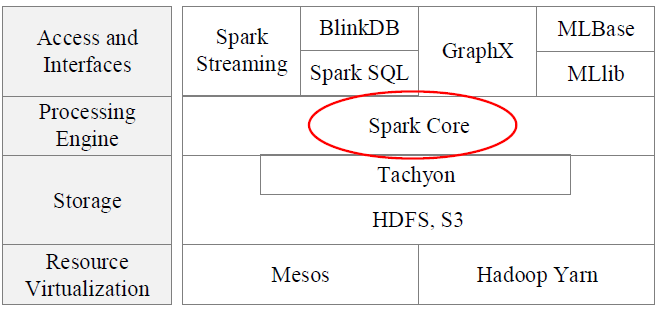
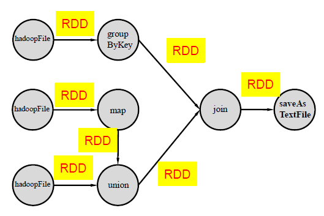
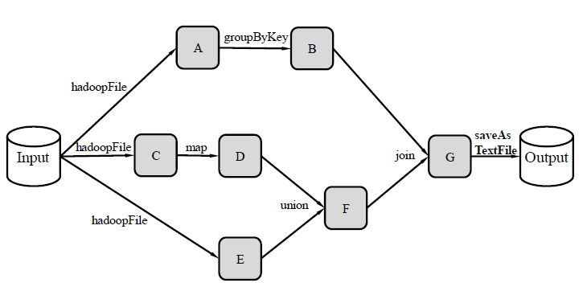
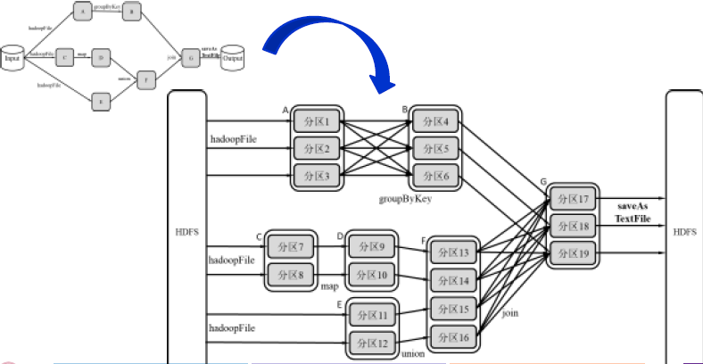
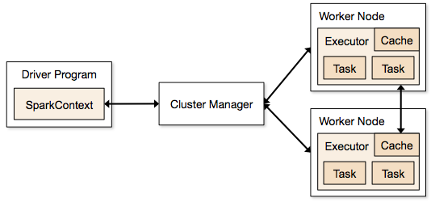
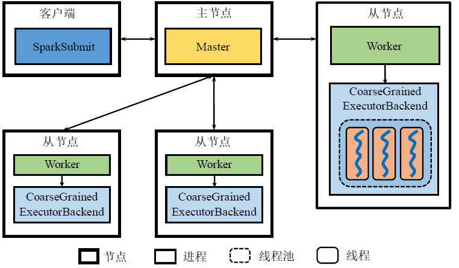
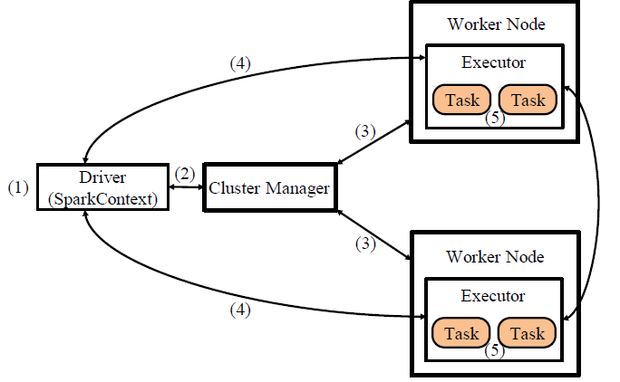
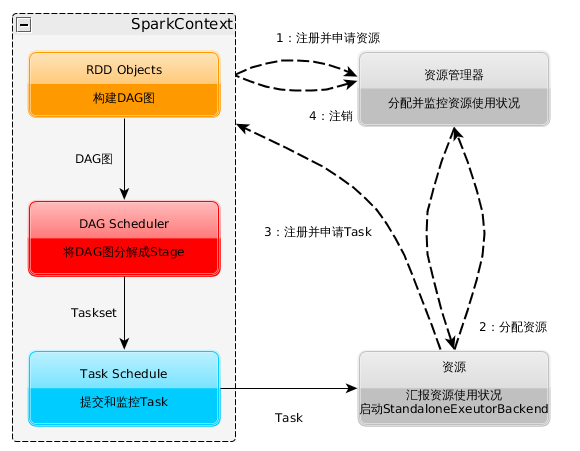
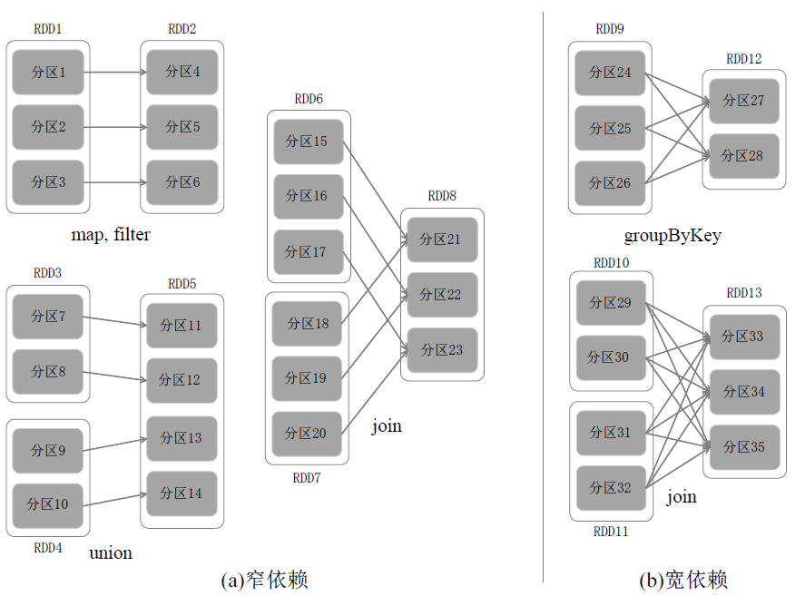

# Spark

> 基于内存计算的大数据并行计算框架，用于构建大型的，低延迟的数据分析应用程序

#### Spark 特点

- 运行速度快：使用DAG执行引擎以支持循环数据流与内存计算

- 容易使用：支持多种语言，有Spark Shell进行交互式编程

- 通用性：Spark提供了完整强大的技术栈，包括SQL查询，流式计算，机器学习和图算法组件

- 运行模式多样：可运行与独立的集群模式中、Hadoop中，云环境中等等

- 软件栈：

  

#### Spark 与 MapReduce 的对比

**MapReduce的局限性：**

1.  编程框架的表达能力有限，用户编程复杂。由于仅有map和reduce函数

2. 单个作业Shuffle阶段的数据以阻塞方式传输，磁盘IO开销大，延迟高

   输入输出及shuffle中间结果，都需要读写磁盘

3. 多个作业之间衔接涉及IO开销，应用程序的延迟高

   特别是迭代计算，中间结果的反复读写，使得整个应用的延迟非常高

### 设计思想

#### Spark的数据模型：RDD

- **RDD**: Resilient Distributed Dataset 弹性分布式数据集
  - 分布式内存的一个抽象概念
  - 提供了一种高度受限的共享内存模型
  - RDD是可恢复的记录分区的数据集合
    - 可恢复的容错特性
    - 每个RDD可分成多个分区，一个RDD的不同分区可以存到集群中不同的节点上。
    - 每个分区就是一个数据集片段

#### Spark的计算模型：DAG

- RDD的操作算子：

  - Transformation: RDD转换为另一个RDD，主要是筛选操作，如filter，map，flatmap等
  - Action：计算操作，往往在最后一步给出结果。如count，collect，take，reduce等

- 逻辑计算模型

  - 从算子操作的角度来描述计算的过程：Operator DAG

  

  - 从RDD变换的角度描述计算过程：RDD Lineage

    

    - RDD Lineage 与 DAG在非严格的情况下可以混用
    - Spark系统会保留RDD Lineage的信息，用于容错

  - RDD是只读的对象及合，经创建后不能进行修改

    - RDD的操作算子只生成新的RDD，不改变原来的RDD
    - 遵循了函数式编程特性

- 物理计算模型

  - 分布式架构中DAG的操作算子实际上由若干实例Task来实现

  - 每个Task通常负责处理RDD的一个分区

    

  

### 体系架构

#### 抽象架构图

- **Cluster Manager**: 集群管理器：

  负责管理整个系统的资源，监控工作节点

  - 使用Standalone部署方式中，集群资源管理器有Master和Worker
  - 使用Yarn部署方式时，集群资源管理器包括Recourse Manager和Node Manager

- **Executor**: 执行器

  负责任务执行。Executor本身是运行在工作节点上的一个进程，它启动若干线程Task或线程组TaskSet来执行任务

  - 在Standalone部署下，Executor进程称为CoarseGrainedExecutorBackend

- **Driver** 驱动器

  负责启动应用程序的主函数并管理作业运行，Driver中的SparkContext类维护了DAG、RDD lineage这些至关重要的信息

##### Standalone 架构图

- Driver和客户端以同一个进程存在

- 某一Worker启动一个进程作为Driver

#### 应用程序执行流程

1. 启动Driver
   - Client部署方式：客户端直接启动Driver，并向Master注册
   - Cluster部署方式：客户端将应用程序提交给Master，Master选择一个Worker启动Driver进程
2. 构建基本运行环境：Driver构建SparkContext，向Master申请资源，任务分配与监控
3. Cluster Manager 通知工作节点启动Executor进程，该进程内部以多线程方式运行任务
4. Executor 进程向Driver注册
5. SparkContext 构建DAG并运行任务划分，从而交给Executor进程中的线程来执行任务

### 工作原理

#### Spark工作过程

1. 构建基本运行环境(由Driver创建SparkContext)

   - SparkContext 向资源管理器注册并申请运行Executor资源，进行任务分配和监控

   - 根据RDD依赖关系构建DAG图，将DAG图提交给DAGScheduler解析成Stage，然后把一个个TaskSet提交给底层调度器TaskSchedule

2. 资源管理器分配Executor资源并启动Executor进程，Executor运行情况将随着心跳发送到资源管理器上；

3. Executor向SparkContext注册并申请Task

   - SparkContext中的Task Scheduler 按照Stage 的拓扑顺序依次将Task发放给Executor运行，并提供应用程序代码给Executor运行Task

4. 直到所有Task运行完毕后写入数据并释放所有资源

#### RDD在Spark架构中的运行过程

1. 创建RDD对象
2. SparkContext负责计算RDD之间的依赖关系，创建DAG
3. DAGScheduler 负责吧DAG图分解成多个Stage，每个Stage中包含了多个Task，每个Task会被TaskScheduler分发给各个WorkerNode上的Executor去执行

#### DAG的Stage划分

##### RDD依赖关系的分类

- 宽依赖

  - 一个父RDD的一个分区对应一个子RDD 

- 窄依赖

  - 一个父RDD的分区对应于一个子RDD的分区；
  - 多个父RDD的分区对应于一个子RDD的分区

- 举例

  

  

>  分析各个RDD的偏序关系生成DAG，在通过分析各个RDD中的分区之间的依赖关系来决定如何划分Stage

- 划分Stage的方法
  - 在DAG中进行反向解析，遇到宽依赖就断开
  - 玉带窄依赖就把当前的RDD加入到Stage中
  - 