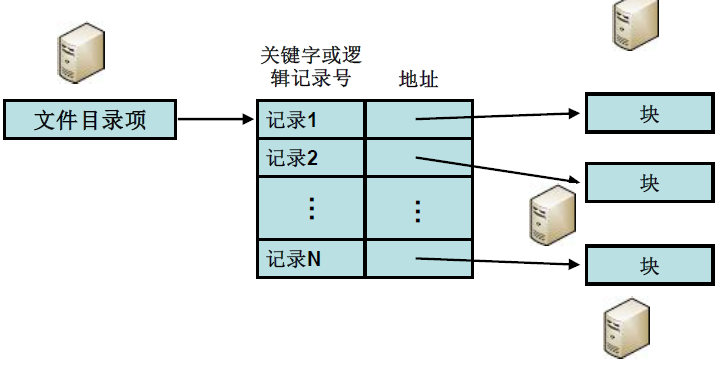
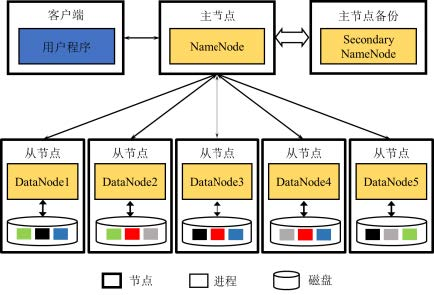
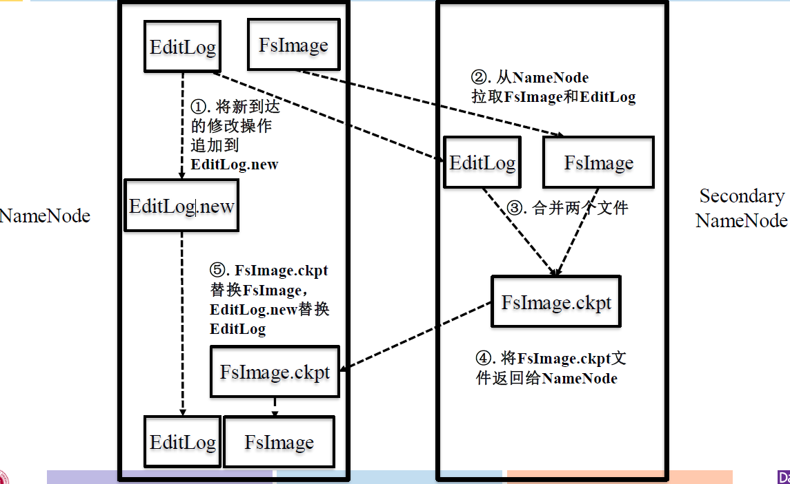

# 分布式文件系统 HDFS

## 文件系统复习

### 概述

**文件系统出现的的原因**：

&emsp; &emsp; 用户直接操作和管理辅助存储器上信息（ 01二进制序列），繁琐复杂、易于出错可靠性差

**文件系统**：管理和存取信息的模块

- 统一管理用户和系统信息的存储、 检索、更新、共享和保护
- 为用户提供一整套方便有效的文件使用和操作方法

**文件系统的功能**

- 文件按名存取
- 文件目录的建立和维护
- 实现逻辑文件到物理文件的转换
- 文件存储空间的分配和管理
- 数据保密、保护和共享
- 提供一组用户使用的操作

## Hadoop分布式文件系统（HDFS）

### 设计思想

#### 大文件存储：分块存储

将文件分成数据块，通常每个数据块的大小为64MB。每个数据块在本地系统中是以单独的文件进行存储的。

**物理结构：**跨机器索引

**分块冗余存储**：对每块分别备份

**文件读写：**

- 避免读写冲突：文件一次写入后不能修改，仅容许多次读取。（若要更改文件，只能删除重写。）
- 避免随机写：仅支持顺序写入而不容许随机写入

**HDFS设计假设、目标：**

- 硬件失效：
  - 硬件的异常比软件的异常更加常见，硬件异常是常态
  - HDFS需要检测这些异常，并自动恢复数据
- 流式数据访问
  - 基于HDFS上的应用仅采用流方式读取数据
  - 应用程序关注吞吐量而非响应时间
- 存储数据较大：GB到TB级别
- 简化的数据一致性模型
- 多硬件平台支持
- 移动计算能力比移动数据更划算

### 体系架构

#### 采用Master-Slaver模式：

- NameNode中心服务器（Master）:
  - 负责文件系统元数据操作、负责文件系统元数据操作、 数据块的复制和定位
  - 维护文件系统树、以及整棵树内的文件目录、负责整个数据集群的管理。
  - NameNode启动的时候，会将镜像文件和日志文件的内容在内存中合并。把内存中的元数据更新到最新状态。
  - FsImage： 内存在文件目录机构及其元信息在磁盘上的快照
  - EditLog：两次快照之间，针对目录及文件修改的操作

- SecondaryNameNode
  - NameNode的备份节点
- DataNode:
  - 集群中每个节点一个数据节点
  - 负责数据块的存储，为客户端提供实际文件数据
  - 分布在不同的**机架**上（Slaver）：在客户端或者NameNode的调度下，存储并检索数据块，并且定期向NameNode发送所存储的数据块的列表。
- 客户端从NameNode获取**元数据**；与DataNode交互获取数据。
- 
- 在HDFS中，NameNode 和 DataNode之间使用TCP协议进行通信。DataNode每3s向NameNode发送一个心跳。每10次心跳后，向NameNode发送一个数据块报告自己的信息，通过这些信息，NameNode能够重建元数据，并确保每个数据块有足够的副本。

#### 基本概念

- 元数据：

  &emsp;&emsp;指HDFS文件系统中，文件和目录的属性信息。HDFS实现时，采用了 镜像文件（Fsimage） + 日志文件（EditLog）的备份机制。文件的镜像文件中内容包括：修改时间、访问时间、数据块大小、组成文件的数据块的存储位置信息。目录的镜像文件内容包括：修改时间、访问控制权限等信息。日志文件记录的是：HDFS的更新操作。

- 机架：

  &emsp;&emsp;HDFS集群，由分布在多个机架上的大量DataNode组成，不同机架之间节点通过交换机通信，HDFS通过机架感知策略，使NameNode能够确定每个DataNode所属的机架ID，使用副本存放策略，来改进数据的可靠性、可用性和网络带宽的利用率。

#### 执行流程

1. 客户端向NameNode发送文件操作请求
2. NameNode反馈
   - 如果是读写文件操作，则NameNode告知Client文件块存储位置信息
   - 如果是创建、删除、重命名目录或文件等操作，NameNode修改文件目录结构成功后结束
   - 对于删除操作，HDFS并不会立即去删除DataNode上的数据块，而是等到特定时间才会真正删除
3. 对于读写文件操作，客户端获取具体位置信息后再与DataNode进行读写交互

### 工作原理

#### 文件分块与备份

- 备份：默认情况下，每个DataNode都保存了3个副本，其中两个保存在同一个机架的两个不同的节点上。另一个副本放在不同机架上的节点上。
- 文件块：最基本存储单位；默认64MB
- HDFS中如果一个文件块没有装满并不占用整个数据块存储空间
- 文件块存放策略（启发式） 
  - 第一个副本：放置在上传文件的数据节点；如果是集群外提交，则随机挑选一台磁盘不太满、 CPU不太忙的节点 (快速写入 )
  - 第二个副本：放置在与一不同的机架的节点上(减少跨 rack的网络流量 )
  - 第三个副本：与第一个副本相同机架的其他节点 上(应对交换机故障 )
  - 更多副本：随机节点

#### 数据读取策略

- 当客户端读取数据时 ，从 NameNode获得数据块不同副本的存放位置列表 ，列表中包含了副本所有数据节点
- 可以调用API来确定客户和这些数据节点所属的机架ID
- **最近者优先原则**：当发现某个数据块副本对应的机架和客户端对应的机架ID相同时，就选择该副本读取数据；如果没有发现，就随机选择一个副本读取数据

#### 文件读取一致性

- 一个文件一旦创建写入和关闭后就不能更改，只能读取。如果更改，只能删除再写入
- 已经写入到HDFS文件，仅容许末尾追加
- 当对一个文件执行写入操作时（包括追加），NameNode将拒绝其他针对改文件的读写请求
- 当对一个文件进行读取操作时，NameNode容许其他针对该文件的读请求

### 容错机制

**NameNode故障**

- 根据SecondaryNameNode中的FsImage和Editlog数据进行恢复

**DataNode故障**

- "宕机"：节点上所有数据都会被标记为"不可读"
- 定期检查备份因子

### 参考资料：

[1]: ./Lecture/Lecture-3-分布式文件系统-HDFS.pdf
[2]: https://blog.csdn.net/u013063153/article/details/53114678	"CSDN Hadoop架构介绍"

