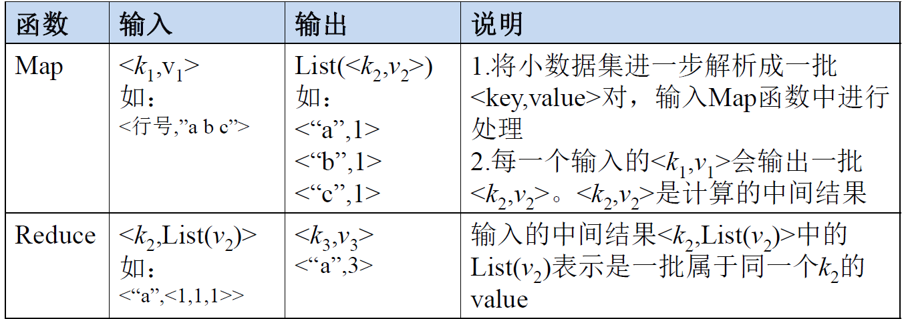
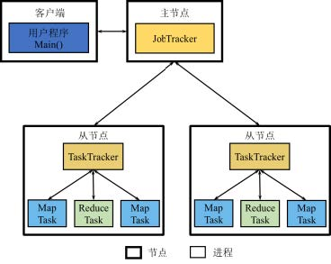
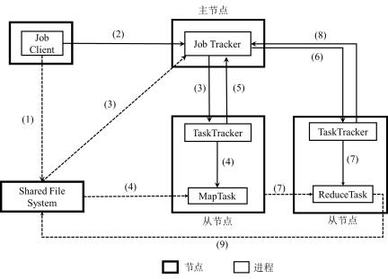

# 批处理系统MapReduce

MapReduce是对并行计算的封装，使用户通过一些简单的逻辑即可完成复杂的并行计算。将一个大型的运算任务分解到集群每个节点上，充分运用集群资源，缩短运行时间

### 设计思想

#### MPI与MapReduce

**MPI**：

&emsp;MPI是一个信息传递应用程序的接口，包括协议和语义说明

**MPI的局限性：**

- 从用户编程的角度看，用户需要考虑进程间的并行问题，并且进程之间的通信需要在程序中显式地表达
- 从系统实现的角度看，MPI是以多进程方式运行，如果在运行中一个进程因故障崩溃，那么除非用户在编写程序时添加了故障恢复功能，否则MPI框架不提供容错能力

#### 数据模型

将数据抽象为一系列键值对，在处理过程中对键值对进行转换

#### 计算模型

MapReduce将大量复杂的运行于大规模集群上的并行运算高度抽象为Map和Reduce两个过程

### 体系架构

#### 架构图

**JobTracker**

- 集群资源管理：监控TaskTracker与Job的状况

- 集群作业管理：将Job拆分成Task，跟踪Task的执行进度，资源使用等信息

**TaskTracker**

- 接收命令并执行
- 资源划分
- 汇报信息

**Task**

