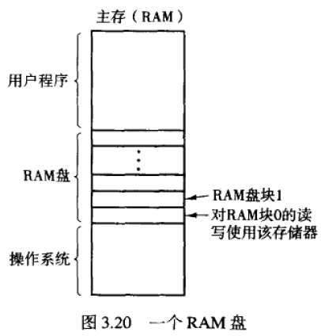

## RAM 盘

#### 定义：

RAM盘：

- 在内存中保留一部分存储区域，使其象普通磁盘一样使用。

- RAM盘不提供永久存储，但可以快速访问

#### 基本思想

- 根据为RAM盘分配内存的大小，RAM盘被分成n块，每块的大小和实际磁盘块的大小相同。
- 当驱动程序接收到一条读写一个数据块的消息时，它只计算被请求的块在RAM盘存储区的位置，并读出或写入该块。

- 数据的传输是通过phys_copy汇编语言调用加以实现

- 一个RAM盘驱动程序可以支持多个RAM盘，每个RAM盘用**次设备号**来区分

  

#### MINIX3 中的RAM盘驱动程序

- RAM盘驱动程序对应的六个RAM相关次设备

  /dev/ram, /dev/kmem/, /dev/boot, 

  /dev/mem/, /dev/null, /dev/zero

  传给驱动程序的每条消息都要指定上述次设备之一

- /dev/ram是真正的RAM盘，驱动程序内部既不指定它的大小，也不指定它的起始地址。这些是系统启动时由文件系统所确定的

- /dev/mem，/dev/kmem分别用于读写物理内存和内核内存

  - /dev/mem读时，读出的是起始于绝对地址零的物理内存中的内容
  - /dev/kmem与/dev/mem相似，但读的是内核数据存储区的第0个字节，而其绝对地址随MINIX内核代码大小的改变

- /dev/null 是一个接收数据并把数据抛弃掉的设备文件。如./a.out > /dev/null

- 存储区域由数组ram_origin和ram_limit确定，通过次设备号进行索引

#### MINIX3 中的RAM盘驱动程序的实现

- 设备相关代码：/usr/src/minix/drivers/storage/memory/memory.c

- 设备无关代码：/usr/src/minix/lib/libblockdriver/driver.c

## 磁盘

#### 磁盘硬件

