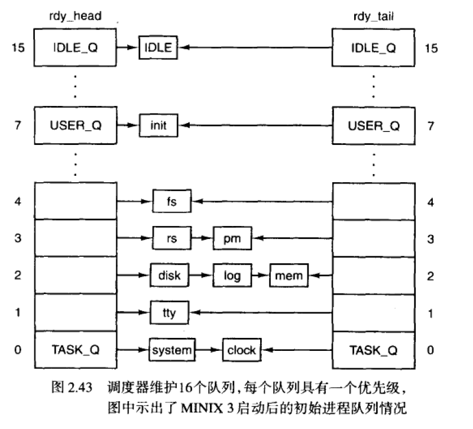

## MINIX 的进程调度

#### MINIX3使用多级调度算法，初始化的优先级如图，



- 第一层时钟任务和系统任务获得最高优先级
- 第二层设备驱动程序
- 第三层服务器进程

- 进程IDLE总是处于就绪状态，并且位于最低优先级队列，如果所有的高优先级队列都空，则IDLE进程将会进行。


- rdy_head数组中的每一项对应一个对列，这一项指向相应队列的头进程。
- rdy_tail数组中的每一项指向对应队列尾的进程

- 在系统初始化过程中，初始进程的排队函数由table.c中的image表决定


- 每个队列内部采用时间片轮转调度算法
- 如果一个运行的进程用完了他的时间片，则它被移到队列尾部并分配一个新的时间片。然而当一个阻塞的进程被唤醒时，如果在阻塞前有没有用完它的时间片，则它将被放在队首，且使用之前没用完的时间片
- 调度算法：找到最高非空优先级队列，选取队列首部的进程。

#### enqueue 和dequeue

- enqueue 

```c
/*===========================================================================*
 *				                    enqueue					                 * 
 *===========================================================================*/
void enqueue(
  register struct proc *rp	/* 指向一个正在运行的进程 */
)
{
/* 这个函数负责将进程rp插入就绪进程队列的队尾，等待调度*/
  int q = rp->p_priority;	 		/* 获取该进程的优先级 */
  struct proc **rdy_head, **rdy_tail;
  
  assert(proc_is_runnable(rp));		/* 检查rp进程是否就绪*/
  assert(q >= 0);					/* 检查进程优先级是否大于等于0*/

  rdy_head = get_cpu_var(rp->p_cpu, run_q_head);
  rdy_tail = get_cpu_var(rp->p_cpu, run_q_tail);

  /* Now add the process to the queue. */
  if (!rdy_head[q]) {		/*添加到空队列*/
      rdy_head[q] = rdy_tail[q] = rp; 		/* create a new queue */
      rp->p_nextready = NULL;		/* mark new end */
  } 
  else {					/* add to tail of queue */
      rdy_tail[q]->p_nextready = rp;		/* chain tail of queue */	
      rdy_tail[q] = rp;				/* set new queue tail */
      rp->p_nextready = NULL;		/* mark new end */
  }

  if (cpuid == rp->p_cpu) {
	  /*
	   * enqueueing a process with a higher priority than the current one,
	   * it gets preempted. The current process must be preemptible. Testing
	   * the priority also makes sure that a process does not preempt itself
	   */
	  struct proc * p;
	  p = get_cpulocal_var(proc_ptr);
	  assert(p);
	  if((p->p_priority > rp->p_priority) &&
			  (priv(p)->s_flags & PREEMPTIBLE))
		  RTS_SET(p, RTS_PREEMPTED); /* calls dequeue() */
  }
#ifdef CONFIG_SMP
  /*
   * if the process was enqueued on a different cpu and the cpu is idle, i.e.
   * the time is off, we need to wake up that cpu and let it schedule this new
   * process
   */
  else if (get_cpu_var(rp->p_cpu, cpu_is_idle)) {
	  smp_schedule(rp->p_cpu);
  }
#endif

  /* Make note of when this process was added to queue */
  read_tsc_64(&(get_cpulocal_var(proc_ptr)->p_accounting.enter_queue));


#if DEBUG_SANITYCHECKS
  assert(runqueues_ok_local());
#endif
}
```

assert宏的原型定义在<assert.h>中，其作用是如果它的条件返回错误，则终止程序执行，原型定义：

```c
#include <assert.h>
void assert( int expression );
```

```c
/*===========================================================================*
 *			                	enqueue_head			              	     *
 *===========================================================================*/
/* 将进程放在就需进程队列的队首.*/
static void enqueue_head(struct proc *rp)
{
  const int q = rp->p_priority;	 		
  struct proc **rdy_head, **rdy_tail;

  assert(proc_ptr_ok(rp));
  assert(proc_is_runnable(rp));

  /*
   * the process was runnable without its quantum expired when dequeued. A
   * process with no time left should have been handled else and differently
   */
  assert(rp->p_cpu_time_left);
  assert(q >= 0);

  rdy_head = get_cpu_var(rp->p_cpu, run_q_head);
  rdy_tail = get_cpu_var(rp->p_cpu, run_q_tail);

  /* Now add the process to the queue. */
  if (!rdy_head[q]) {		/* add to empty queue */
	rdy_head[q] = rdy_tail[q] = rp; 	/* create a new queue */
	rp->p_nextready = NULL;			/* mark new end */
  } else {					/* add to head of queue */
	rp->p_nextready = rdy_head[q];		/* chain head of queue */
	rdy_head[q] = rp;			/* set new queue head */
  }

  /* Make note of when this process was added to queue */
  read_tsc_64(&(get_cpulocal_var(proc_ptr->p_accounting.enter_queue)));

  /* Process accounting for scheduling */
  rp->p_accounting.dequeues--;
  rp->p_accounting.preempted++;

#if DEBUG_SANITYCHECKS
  assert(runqueues_ok_local());
#endif
}
```

- dequeue

```c
/*===========================================================================*
 *			                   	  dequeue				        	         * 
 *===========================================================================*/
void dequeue(struct proc *rp)
/* 进程不再就绪 */
{
/* 将一个进程转换为非就绪态，将进程移出调度队列
 * This function can operate x-cpu as it always removes the process from the
 * queue of the cpu the process is currently assigned to.
 */
  int q = rp->p_priority;		
  struct proc **xpp;			/* iterate over queue */
  struct proc *prev_xp;
  u64_t tsc, tsc_delta;

  struct proc **rdy_tail;

  assert(proc_ptr_ok(rp));
  assert(!proc_is_runnable(rp));

  /* Side-effect for kernel: check if the task's stack still is ok? */
  assert (!iskernelp(rp) || *priv(rp)->s_stack_guard == STACK_GUARD);

  rdy_tail = get_cpu_var(rp->p_cpu, run_q_tail);

  /* Now make sure that the process is not in its ready queue. Remove the 
   * process if it is found. A process can be made unready even if it is not 
   * running by being sent a signal that kills it.
   */
  prev_xp = NULL;				
  for (xpp = get_cpu_var_ptr(rp->p_cpu, run_q_head[q]); *xpp;
		  xpp = &(*xpp)->p_nextready) {
      if (*xpp == rp) {				/* found process to remove */
          *xpp = (*xpp)->p_nextready;		/* replace with next chain */
          if (rp == rdy_tail[q]) {		/* queue tail removed */
              rdy_tail[q] = prev_xp;		/* set new tail */
	  }

          break;
      }
      prev_xp = *xpp;				/* save previous in chain */
  }

	
  /* Process accounting for scheduling */
  rp->p_accounting.dequeues++;

  /* this is not all that accurate on virtual machines, especially with
     IO bound processes that only spend a short amount of time in the queue
     at a time. */
  if (rp->p_accounting.enter_queue) {
	read_tsc_64(&tsc);
	tsc_delta = tsc - rp->p_accounting.enter_queue;
	rp->p_accounting.time_in_queue = rp->p_accounting.time_in_queue +
		tsc_delta;
	rp->p_accounting.enter_queue = 0;
  }


#if DEBUG_SANITYCHECKS
  assert(runqueues_ok_local());
#endif
}
```

- pick_proc

```c
/*===========================================================================*
 *			                   	pick_proc			                         * 
 *===========================================================================*/
static struct proc * pick_proc(void)
{
/* Decide who to run now.  A new process is selected an returned.
 * When a billable process is selected, record it in 'bill_ptr', so that the 
 * clock task can tell who to bill for system time.
 * This function always uses the run queues of the local cpu!
 */
  register struct proc *rp;			/* process to run */
  struct proc **rdy_head;
  int q;				/* iterate over queues */

  /* Check each of the scheduling queues for ready processes. The number of
   * queues is defined in proc.h, and priorities are set in the task table.
   * If there are no processes ready to run, return NULL.
   */
  rdy_head = get_cpulocal_var(run_q_head);
  for (q=0; q < NR_SCHED_QUEUES; q++) {	
	if(!(rp = rdy_head[q])) {
		TRACE(VF_PICKPROC, printf("cpu %d queue %d empty\n", cpuid, q););
		continue;
	}
	assert(proc_is_runnable(rp));
	if (priv(rp)->s_flags & BILLABLE)	 	
		get_cpulocal_var(bill_ptr) = rp; /* bill for system time */
	return rp;
  }
  return NULL;
}

```
- switch_to_user

```
/*===========================================================================*
 *				switch_to_user				     * 
 *===========================================================================*/
void switch_to_user(void)
{
	/* This function is called an instant before proc_ptr is
	 * to be scheduled again.
	 */
	struct proc * p;
#ifdef CONFIG_SMP
	int tlb_must_refresh = 0;
#endif

	p = get_cpulocal_var(proc_ptr);
	/*
	 * if the current process is still runnable check the misc flags and let
	 * it run unless it becomes not runnable in the meantime
	 */
	if (proc_is_runnable(p))
		goto check_misc_flags;
	/*
	 * if a process becomes not runnable while handling the misc flags, we
	 * need to pick a new one here and start from scratch. Also if the
	 * current process wasn't runnable, we pick a new one here
	 */
not_runnable_pick_new:
	if (proc_is_preempted(p)) {
		p->p_rts_flags &= ~RTS_PREEMPTED;
		if (proc_is_runnable(p)) {
			if (p->p_cpu_time_left)
				enqueue_head(p);
			else
				enqueue(p);
		}
	}

	/*
	 * if we have no process to run, set IDLE as the current process for
	 * time accounting and put the cpu in an idle state. After the next
	 * timer interrupt the execution resumes here and we can pick another
	 * process. If there is still nothing runnable we "schedule" IDLE again
	 */
	while (!(p = pick_proc())) {
		idle();
	}

	/* update the global variable */
	get_cpulocal_var(proc_ptr) = p;

#ifdef CONFIG_SMP
	if (p->p_misc_flags & MF_FLUSH_TLB && get_cpulocal_var(ptproc) == p)
		tlb_must_refresh = 1;
#endif
	switch_address_space(p);

check_misc_flags:

	assert(p);
	assert(proc_is_runnable(p));
	while (p->p_misc_flags &
		(MF_KCALL_RESUME | MF_DELIVERMSG |
		 MF_SC_DEFER | MF_SC_TRACE | MF_SC_ACTIVE)) {

		assert(proc_is_runnable(p));
		if (p->p_misc_flags & MF_KCALL_RESUME) {
			kernel_call_resume(p);
		}
		else if (p->p_misc_flags & MF_DELIVERMSG) {
			TRACE(VF_SCHEDULING, printf("delivering to %s / %d\n",
				p->p_name, p->p_endpoint););
			delivermsg(p);
		}
		else if (p->p_misc_flags & MF_SC_DEFER) {
			/* Perform the system call that we deferred earlier. */

			assert (!(p->p_misc_flags & MF_SC_ACTIVE));

			arch_do_syscall(p);

			/* If the process is stopped for signal delivery, and
			 * not blocked sending a message after the system call,
			 * inform PM.
			 */
			if ((p->p_misc_flags & MF_SIG_DELAY) &&
					!RTS_ISSET(p, RTS_SENDING))
				sig_delay_done(p);
		}
		else if (p->p_misc_flags & MF_SC_TRACE) {
			/* Trigger a system call leave event if this was a
			 * system call. We must do this after processing the
			 * other flags above, both for tracing correctness and
			 * to be able to use 'break'.
			 */
			if (!(p->p_misc_flags & MF_SC_ACTIVE))
				break;

			p->p_misc_flags &=
				~(MF_SC_TRACE | MF_SC_ACTIVE);

			/* Signal the "leave system call" event.
			 * Block the process.
			 */
			cause_sig(proc_nr(p), SIGTRAP);
		}
		else if (p->p_misc_flags & MF_SC_ACTIVE) {
			/* If MF_SC_ACTIVE was set, remove it now:
			 * we're leaving the system call.
			 */
			p->p_misc_flags &= ~MF_SC_ACTIVE;

			break;
		}

		/*
		 * the selected process might not be runnable anymore. We have
		 * to checkit and schedule another one
		 */
		if (!proc_is_runnable(p))
			goto not_runnable_pick_new;
	}
	/*
	 * check the quantum left before it runs again. We must do it only here
	 * as we are sure that a possible out-of-quantum message to the
	 * scheduler will not collide with the regular ipc
	 */
	if (!p->p_cpu_time_left)
		proc_no_time(p);
	/*
	 * After handling the misc flags the selected process might not be
	 * runnable anymore. We have to checkit and schedule another one
	 */
	if (!proc_is_runnable(p))
		goto not_runnable_pick_new;

	TRACE(VF_SCHEDULING, printf("cpu %d starting %s / %d "
				"pc 0x%08x\n",
		cpuid, p->p_name, p->p_endpoint, p->p_reg.pc););
#if DEBUG_TRACE
	p->p_schedules++;
#endif

	p = arch_finish_switch_to_user();
	assert(p->p_cpu_time_left);

	context_stop(proc_addr(KERNEL));

	/* If the process isn't the owner of FPU, enable the FPU exception */
	if (get_cpulocal_var(fpu_owner) != p)
		enable_fpu_exception();
	else
		disable_fpu_exception();

	/* If MF_CONTEXT_SET is set, don't clobber process state within
	 * the kernel. The next kernel entry is OK again though.
	 */
	p->p_misc_flags &= ~MF_CONTEXT_SET;

#if defined(__i386__)
  	assert(p->p_seg.p_cr3 != 0);
#elif defined(__arm__)
	assert(p->p_seg.p_ttbr != 0);
#endif
#ifdef CONFIG_SMP
	if (p->p_misc_flags & MF_FLUSH_TLB) {
		if (tlb_must_refresh)
			refresh_tlb();
		p->p_misc_flags &= ~MF_FLUSH_TLB;
	}
#endif
	
	restart_local_timer();
	
	/*
	 * restore_user_context() carries out the actual mode switch from kernel
	 * to userspace. This function does not return
	 */
	restore_user_context(p);
	NOT_REACHABLE;
}

```

