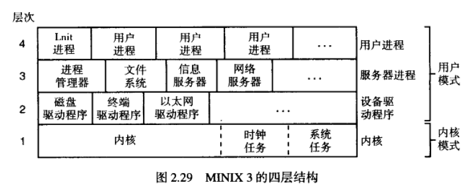

# MINIX进程概述

> 概述：进程管理、进程间通信，进程调度在MINIX中的应用

微内核结构（很小的内核，将宏内核中的内容尽量的放到用户空间），是一组进程的集合，更多功能由用户进程实现结合，内核功能较少，进程间通信通过IPC机制（消息传递）进行通信（内核实现的）。

**微内核更安全稳定，更灵活，更模块化，但性能有所损耗（由于大量进程通信）。**

### MINIX的四层结构



#### 第一层：内核层

- 处于最底层，运行于内核模式，是C语言+汇编语言实现的
- 内核负责
  - 进程的调度，进程在就绪态阻塞态运行态之间的转换，
  - 处理所有进程间的通信，并核实目标的合法性，定位内存中的发送和接收缓存，把消息从发送缓存复制到接收缓存。
  - 支持对I/O端口和中断的访问
- 时钟任务模块，产生时钟信号。
  - 时钟任务是一个I/O设备驱动程序，但只提供内核接口，用户不能访问
- 系统任务模块：读写I/O端口，跨地址空间复制数据
- 尽管系统任务和时钟任务被编译进了内核地址空间，但他们作为单独的进程调用，并拥有自己的调用堆栈

> 内核层上三层，可以看做一层，因为内核同样对待他们，每一层只限于使用用户模式指令，每一层由内核调度执行。他们都不能直接对I/O端口进行操作；他们都不能访问分配给他们之外的内存。
>
> 不同之处在于第二层第三层相对于第四层有一些特权，统称为系统进程，在系统活动期间进程不会终止

#### 第二层：设备驱动层

- 调用内核中的系统任务模块，去读写I/O端口的数据
- 不同类型设备（磁盘，打印机……），需要不同的驱动程序
- 也可以调用其他内核调用

#### 第三层：服务器层

- 进程管理器PM
  - 创建、终止进程 fork，exec，wait
  - 信号相关的系统调用：alarm，kill
  - 管理内存：brk
- 文件系统服务器
  - 执行文件系统的调用：read，mount，chdir
- 再生服务器
  - 启动或重启相关的设备驱动程序等

#### 用户进程层

- 包括所有的用户进程
  - Shell，编辑器。。。
  - 用户运行的程序
  - 守护进程：周期性运行的后台进程
  - Init进程

### 相关说明

- 设备驱动层和服务器层的进程成为系统进程

- 优先级：

  内核进程>设备驱动层进程>服务器层进程>用户进程层进程

复习：操作系统负责两件事：管理资源、通过实现系统调用提供一个可扩展的计算机

## MINIX3启动

#### 启动顺序

Bootstrap（引导程序） -> boot(boot image) -> Kernel -> 系统任务、时钟任务 -> 系统进程 -> init进程 -> 用户进程

- 引导映像 boot image

  - 由boot转载至内存的适当位置
  - 包括多个部分：内核、进程管理器、文件系统、…
  - 每个部分都是独立的程序

- 进程树初始化，init进程

  - 引导映像最后加载的一个进程
  - PID为1，但不是系统中运行的第一个进程（进程管理器进程的PID为0，但不是其他进程的父进程）
  - 执行/etc/rc脚本，结合再生服务器进程，启动其它的驱动程序和服务器
  - 执行/etc/rc脚本，启动守护进程
  - 读取其它配置文件，进行系统检查、启动终端设备、启动用户登录界面、启动shell、……

  

## Minix3 进程间通信

- 内核将消息从发送者复制到接收者
- 系统进程、时钟任务、系统任务只允许与特定的进程通信
- 当一个进程发送消息，而目标进程尚未开始接收消息时，发送进程将阻塞
- send，receive机制避免了缓存管理

```c
send(dest,&message);		//用来向进程dest发送一条信息
receive(source,&message)   //用来接收来自进程source的一条信息
sendrec(src_dst,&message)   //用来发送一条信息，并等待同一条进程的应答
```

- notify原语
  - 用于一个进程向另一个进程发送通知消息，notify调用不会阻塞
  - 通知中的内容只有：发送者身份和时间戳

```c
notify(dest);				//通知dest进程，发送者不会阻塞
```

​	

## Minix3 进程调度

Minix3调度器采用多级排队系统，定义16个队列

- 系统任务和时钟任务处于最高优先级
- IDLE进程在系统没有其他进程运行时，具有最低优先级
- 一个进程根据需要在不同优先级调整
- 不同优先级中的进程时间片长度不一

- 使用一个改进的轮转调度算法
  - 进程转为非就绪时，他的时间片还没有用完，则表明发生I/O阻塞，则该进程再次转为就绪时，将其放在**队首** ，分配的时间片为上次时间片中剩余的时间
  - 一个用完时间片的进程则放在队尾
  - 

>  2019年4月19日更改

