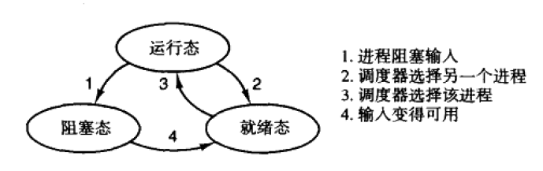
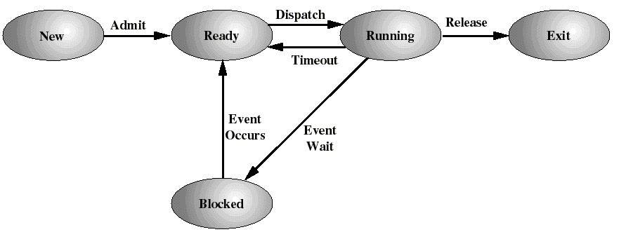

修改日期：2019年4月20日

# 进程介绍

### 进程模型
* 进程：进程是对正在运行程序的一个抽象，包括程序计数器、寄存器和变量的当前值。从概念上说，每个进程都有自己的虚拟CPU，而实际上CPU通过进程切换来实现。

* 物理计数器&逻辑计数器

    >每个进程有自己的一个逻辑计数器，当轮到这个进程运行时，他的逻辑计数器被装入物理的计数器中，随着进程切换，物理程序计数器被保存到内存中该进程的逻辑程序计数器中
    
* 在对进程编程时，绝不能对时序做任何固定的假设

* 上下文切换：保存当前状态，载入新进程的之前保存的状态
### 进程的创建
#### 进程创建的主要原因
1. 系统初始化
2. 正在运行的一个进程执行了创建进程的系统调用
3. 用户请求创建一个新进程
4. 批处理作业的初始化：大型机的批处理系统中应用，在操作系统认为有资源运行另一作业时，它创建一新的进程
* 守护进程： 处于后台，在请求消息到来时才会醒来处理请求的进程
### 进程的终止
#### 进程终止的主要原因
1. 正常退出（自愿）
2. 出错退出（自愿）:进程发现了错误
3. 严重错误（非自愿：进程引起了错误，如执行了非法指令，引用不存在内存
4. 被其他进程杀死 kill
#### 方法

- kill： 向进程发送信号，可以终止进程
- exit：用于进程终止自身

### 进程的层次结构

#### 子进程

- 每个进程只有一个父进程
- 一个进程可以有多个子进程

#### 进程组：
进程和他的所有子进程及其后裔共同组成一个进程组。当用户从键盘发出一个信号时，该信号被送给当前与键盘相关的进程组中的所有成员。每个成员可以选择捕获、忽略或者采取默认动作。
#### Minix3启动初始化：
 * 在引导映像中有两个特殊的进程：**再生服务器**，**init**
 * 再生服务器：启动或重启驱动和服务器；它初始处于阻塞态，等待消息告诉它创建什么。
 * init：执行/etc/rc脚本，并向再生服务器发送启动引导映像中不存在的驱动和服务器。这个过程使所有的驱动和服务器进程都是再生服务器进程的子进程。所以，如果其中某些进程终止时，再生服务器会收到通知，并重新启动他们。当init完成这些之后，它读取配置文件/etc/ttytab中的内容查看存在哪个终端或虚拟终端。init为每个终端（fork）产生一个getty进程，显示登录提示符；等待输入；getty以输入的名字运行login进程。如果登陆成功，启动shell进程。所以shell进程是init进程的一个子进程。
### 进程的状态
 * 当一个进程逻辑上能不能再运行就会被阻塞，典型的例子是他在等待可以使用的输入。
 * 当操作系统调度另一个进程抢占CPU，进程就会被迫停止。
 * 进程的状态：
	1. 运行态：实际占用处理机
	2. 就绪态：可运行，因为其它进程正在运行而暂时被挂起
	3. 阻塞态：除非外部事件发生否则不能运行

### 进程的实现

#### 进程控制块(PCB)

- 进程控制块是由OS维护的用来记录进程相关信息的一块内存
- 每个进程在OS中的登记表项（可能有总数目限制），OS据此对进程进行控制和管理（PCB中的内容会动态改
  变）
- 处于核心段，通常不能由应用程序自身的代码来直接访问，而要通过系统调用，或通过UNIX中的进程文件系
  统(/proc)直接访问进程映象(image)。

- 表项：

| 内核 | 进程管理 | 文件管理 |
| :-----: | :-----: | :-----: |
| 寄存器 | 正文段指针 | UMASK掩码 |
| 程序计数器 | 数据段指针 | 根目录 |
| 程序状态字 | bss段指针 | 工作目录 |
| 栈指针 | 退出状态 | 文件描述符 |
| 进程状态 | 信号状态 | 真实ID |
| 当前调度优先权 | 父进程，进程组 | 系统调用参数 |
| 最大调度优先权 | 进程标识号 | …… |
| Scheduling ticks list | 真实UID、有效UID |  |
| 配额大小 | 真实GID、有效GID |          |
| 使用的CPU时间 | …… |          |
| 进程名字 | | |
| …… | | |

##### 另一个角度理解进程表项：

- 进程描述信息：
  - 进程标识符(process ID)，唯一，通常是一个整数；
  -  进程名，通常基于可执行文件名（不唯一）；
  - 用户标识符(user ID)；进程组关系(process group)
- 进程控制信息：
  - 当前状态；
  - 优先级(priority)；
  -  代码执行入口地址；
  -  程序的外存地址；
  - 运行统计信息（执行时间、页面调度）；
  - 进程间同步和通信；阻塞原因
- 资源占用信息：虚拟地址空间的现状、打开文件列表
- CPU现场保护结构：寄存器值（通用、程序计数器PC、状态PSW，地址包括栈指针）

##### PCB的组织方式

- 链表：同一状态的进程其PCB成一链表，多个状态对应多个不同的链表（就绪链表、阻塞链表）

##### 中断处理步骤

1. 硬件压栈程序计数器等

2. 硬件按中断向量下载新的程序计数器
3. 汇编语言程序存储寄存器值(至当前进程的PCB)
4. 汇编语言程序设置新的栈(为运行处理程序作准备)
5. C语言中断服务程序运行
6. 对等待的就绪任务作标识(发生中断后相关进程状态发生变化)
7. 调度程序决定哪个进程是下一个将运行的
8. C语言中断服务程序返回汇编代码
9. 汇编语言程序开始运行新的当前进程(载入寄存器值和内存映射)

### 线程

#### 线程的解读

- 通常情况下，一个进程只有一个地址空间和一个控制流；有些情况下，需要在相同的地址空间中有多个控制流并行运行，就像它们是单独的进程一样，只是它们共享相同的地址空间。这些控制流就被称为线程，有时也称为轻量进程。

- 观察进程的一种方式是把进程是为一组相关资源的集合（地址空间），包括打开的文件、子进程……通过进程的形式把它们放到一起方便管理

- 进程具有的另一个概念是它是一个执行流，通常成为线程。线程具有程序计数器，寄存器，堆栈。

  **所以进程用来集合资源，线程是CPU中调度的实体**

- 线程给进程模型增加的是，允许在同一个进程环境下有多个执行流
- 线程也具有就绪态，运行态和阻塞态

#### 进程表中的进程项和线程项对比

|     每个进程项     | 每个线程项 |
| :----------------: | :--------: |
|      地址空间      | 程序计数器 |
|      全局变量      |   寄存器   |
|      打开文件      |    堆栈    |
|       子进程       |    状态    |
|       定时器       |            |
| 信号和信号处理程序 |            |
|      统计信息      |            |
|                    |            |

#### 线程实现方式的分类

|                          系统级线程                          |                          用户级线程                          |
| :----------------------------------------------------------: | :----------------------------------------------------------: |
|                  操作系统感知的到线程的存在                  |                  操作系统感知不到线程的存在                  |
|                一个线程阻塞，整个进程不会阻塞                |                 当一个线程阻塞，整个进程阻塞                 |
|                       切换线程相对较慢                       |                        切换线程快的多                        |
| 内核维护进程和线程的上下文信息；线程切换由内核完成；时间片分配给线程，所以多线程的进程获得更多CPU时间。 | 用户线程的维护由应用进程完成,用户线程切换不需要内核特权.时间片分配给进程，多线程则每个线程就慢… |
|                                                              |                                                              |

#### 线程的优点

​	减小并发执行的时间和空间开销（线程的创建、退出和调度），因此容许在系统中建立更多的线程来提高并发程度。

- 线程的创建时间比进程短；
- 线程的终止时间比进程短；
- 同进程内的线程切换时间比进程短；
- 由于同进程内线程间共享内存和文件资源，可直接进行不通过内核的通信；