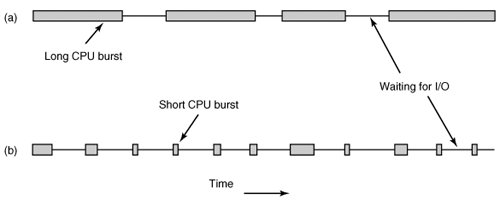
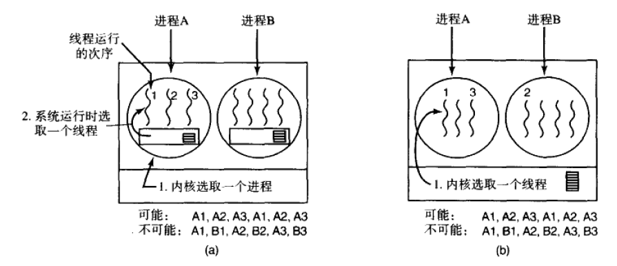

修改日期：2019-4-17 

# 进程调度

由于计算机是多道程序设计，通常有多个进程竞争CPU，所以操作系统必须决定先运行哪个进程。操作系统中做出决定的部分称为调度器，使用的算法称为调度算法。

### 调度介绍

#### 进程行为

- 进程在运行中，会交替地需要CPU进行计算、需要进行I/O操作
- 按CPU计算时间与I/O时间的比例，进程可以分为：
  - 计算密集型：进程的大部分时间花在CPU运算上
  - I/O密集型：它们在I/O请求之间需要较少的CPU运算，而不是因为它们拥有较长的I/O请求时间

- 随着CPU变得越来越快，进程倾向于变成I/O密集型，由于CPU进步速度远快于磁盘的读取的发展的速度

#### 调度时机

- 进程退出
-  进程在I/O或信号量上阻塞
-  创建新进程
-  I/O中断发生
-  时钟中断发生
  -  抢占式调度
  -  非抢占式调度

#### 调度算法的目标

​	不同的环境有不同的目标，所以需要不同调度算法。可大致分为批处理系统、交互式系统和实时系统

- 共同的目标：
  - 公平：给每个进程公平的CPU
  - 策略强制性
  - 平衡：保持系统所有部分忙碌
- 批处理系统
  - 最大化吞吐量：最大化每小时作业数
  - 最小化周转时间：作业从提交到完成（得到结果）所经历的时间。包括：在输入队列中等待，CPU上执行，就绪队列和阻塞队列中等待，结果输出等待
  - 最大化CPU利用率：保持CPU的忙碌，CPU作计算的时间与总时间的比值
- 交互式系统
  - 最小化响应时间：用户输入一个请求（如击键）到系统给出首次响应（如屏幕显示）的时间
  - 均衡性：满足所有用户的需求
- 实时系统：
  - 满足截止时间：避免丢失数据
  - 可预测性：在多媒体系统中避免失真

### 批处理系统中的调度

#### 先来先服务（FCFS）

###### 算法描述：

- 按照作业提交或进程变为就绪状态的先后次序，分派CPU；
- 当前作业或进程占用CPU，直到执行完或阻塞，才出让CPU（非抢占方式）
- 在作业或进程唤醒后（如I/O完成），并不立即恢复执行，通常等到当前作业或进程出让CPU。

###### 特点：

- 比较有利于长作业，而不利于短作业。
- 有利于CPU繁忙的作业，而不利于I/O繁忙的作业。

#### 短作业优先（SJF）

- 适用于运行时间可以预知的批作业的非抢占式调度算法

- 对预计执行时间短的作业（进程）优先分派CPU。通常后来的短作业不抢先正在执行的作业。

- 优点

  -  比FCFS改善平均周转时间，缩短作业的等待时间；

  -  提高系统的吞吐量；

- 缺点
  - 对长作业非常不利，可能长时间得不到执行；
  - 未能依据作业的紧迫程度来划分执行的优先级；
  - 难以准确估计作业（进程）的执行时间，从而影响调度性能。

#### SJF的变型

##### 最短剩余时间优先SRT

- 允许比当前进程剩余时间更短的进程来抢占

##### 最高响应比优先HRRN

- 响应比R = (等待时间+ 要求执行时间) / 要求执行时间
- 是FCFS和SJF的折衷

#### 三级调度

- 准入调度器：选取哪些作业允许进入系统，未选中的作业临时保存在输入队列中
- 内存调度器：进行周期性评估，确定哪些进程驻留内存，哪些进程需要暂存到磁盘中
- CPU调度器：选取将要运行的进程

### 交互式系统调度

#### 时间片轮转(Round Robin)

###### 算法描述

- 其基本思路是通过时间片轮转，提高进程并发性和响应时间特性，从而提高资源利用率；
- 将系统中所有的就绪进程按照FCFS原则，排成一个队列。
- 每次调度时将CPU分派给队首进程，让其执行一个时间片。时间片的长度从几个ms到几百ms。
- 在一个时间片结束时，发生时钟中断
- 调度程序据此暂停当前进程的执行，将其送到就绪队列的末尾，并通过上下文切换执行当前的队首进程。
- 进程可以未使用完一个时间片，就出让CPU（如阻塞）。

######  讨论

- 时间片长度变化的影响
  - 若过长，该算法退化为FCFS算法，进程在一个时间片内都执行完，响应时间长。
  - 若过短，用户的一次请求需要多个时间片才能处理完，上下文切换次数增加，CPU的时间大量浪费在进程切换上，降低CPU效率。
- 对响应时间的要求：
  - 响应时间=进程数目× 时间片长度
- 时间片长度的影响因素：
  - 就绪进程的数目
  - 系统的处理能力

#### 优先级调度

###### 算法描述

- 其基本思想是给每个进程赋予一个优先级，优先调度运行优先级最高的就绪进程，同一个优先级内才有时间片轮转调度

- 优先级调度可以分为静态优先级和动态优先级，静态优先级在创建进程时就确定，直到进程终止前都不改变。可能导致饿死低优先级的进程。

- 动态优先级

  在创建进程时赋予的优先级，在进程运行过程中可以自动改变，以便获得更好的调度性能。例如：

  - 在就绪队列中，等待时间延长则优先级提高，从而使优先级较低的进程在等待足够的时间后，其优先级提高到可被调度执行；
  - 进程每执行一个时间片，就降低其优先级，从而一个进程持续执行时，其优先级降低到出让CPU。

#### 多重队列

###### 算法描述

- 设置多个就绪队列，分别赋予不同的优先级，如逐级降低。每个队列执行时间片的长度也不同，规定优先级越低则时间片越长，如逐级加倍。
- 新进程进入内存后，先投入最高优先级队列的末尾，按FCFS算法调度；若按在最高优先级队列中一个时间片未能执行完，则降低投入到次高优先级队列的末尾，同样按FCFS算法调度；如此下去，降低到最后的队列，则按"时间片轮转"算法调度直到完成。
- 仅当较高优先级的队列为空，才调度较低优先级的队列中的进程执行。如果进程执行时有新进程进入较高优先级的队列，则抢先执行新进程，并把被抢先的进程投入原队列的末尾。

#### 彩票调度算法

###### 算法描述

- 其基本思想是为进程发放针对系统各种资源（如CPU时间）的彩票，当调度程序需作出决策时，随机选择一张彩票，持有该彩票的进程将获得系统资源
- 中奖的机会（被调度的机会）与其持有的彩票数成正比
- 合作进程如果愿意的话可以交换彩票
- 自动地按照正确的比例分配CPU资源

#### 公平分享调度

以分配用户的资源比例为基础，确定用户中进程获得的CPU时间比例

### 实时系统调度

##### 1. 硬实时系统和软实时系统

- 硬实时系统必须满足时间的限制
- 软实时系统偶尔可以超过时间限制

##### 2. 可调度的实时系统

针对多个周期的事件流，若有周期性事件m个，事件i的周期为$P_i$，其中每个事件需要$C_i$秒的CPU时间来处理，则需要满足
$$
\sum^{m}_{i=1}\frac{C_i}{P_i}\le1\\
隐含条件：上下文切换开销很小
$$

静态：系统启动前完成调度决策

动态：运行时做出调度决策

### 调度策略与机制

- 将调度问题分解为调度策略与调度机制
  - 调度机制：将调度算法以某种形式参数化
  - 调度策略：由用户进程填写参数后，相应的策略
  - **调度机制调度策略分离**
- 这不是一个纯理论的问题，很多依据经验或实际应用效果

### 线程调度

若系统中进程包含了多线程，则系统中存在两个层次上的并行性：进程级和线程级

- 线程的实现方式决定线程级的调度模式

  - 用户级线程：由于内核感觉不到线程，所以还像以前一样操作。由进程内部的线程调度器决定哪个线程运行
  
  

|           用户级线程           |                   内核级线程                   |
| :----------------------------: | :--------------------------------------------: |
|             切换快             |                  切换相对较慢                  |
|    一个线程阻塞整个进程阻塞    |          一个线程阻塞整个进程不会阻塞          |
| 特定的应用可以应用定制的调度器 | 内核考虑调度时会将线程间切换的代价较小考虑进去 |

