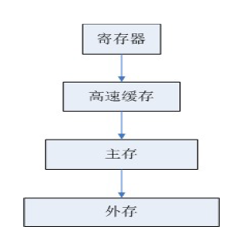
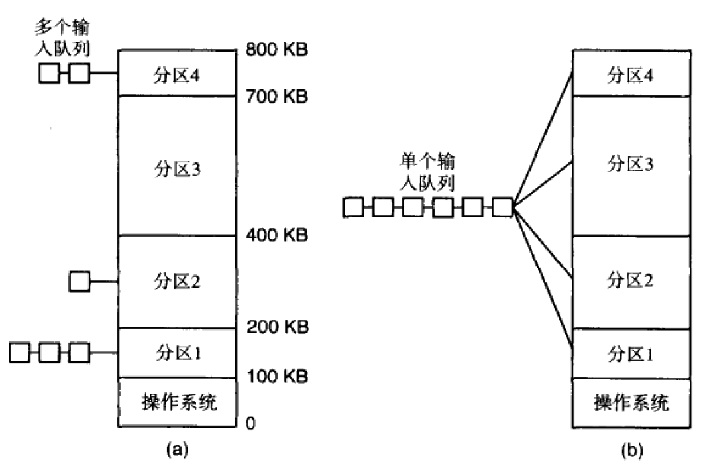
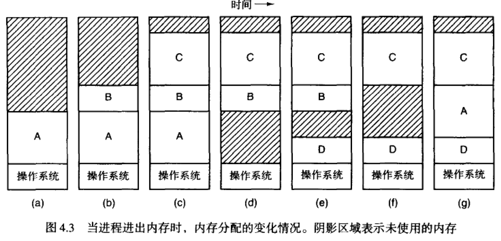
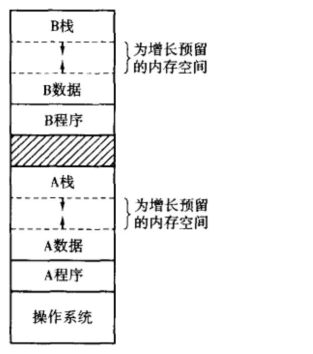

# 存储管理

## 基本的存储管理

#### 层次化存储结构

- 计算机的存储体系

  

  - 少量的非常快速、昂贵、易变的的高速缓存（cache）
  - 若干兆字节的中等速度、中等价格、易变的主存储器（RAM）
  - 数百兆或数千兆字节的低速、廉价、不易变的磁盘(外存)组成

- 存储管理器：
  - 记录存储使用状况
  -  分配、回收存储资源
  -  数据的装入与写回

#### 存储管理系统分类

- 在运行期间，进程需要在内存和磁盘之间换进换出的系统
- 在运行期间，进程不需要在内存和磁盘之间换进换出的系统
  - 进程被调入运行后，它将始终位于内存中，直至运行结束

#### 单道程序存储管理

- 定义：同一时刻只运行一道程序，只能有一个进程在存储器中运行，应用程序和操作系统共享存储器。
- 一旦用户输入了一个命令，操作系统就把需要的程序从磁盘拷贝到存储器中并执行它；在进程运行结束后，操作系统显示出一个提示符并等待新的命令。当收到新的命令时它把新的程序装入存储器，覆盖掉原来的程序。
- 没有交换或分页

#### 多道程序存储管理

- 将内存划分为n个分区（可能不相等），分区的划分可以在系统启动时手工完成

- 具体有两种实现方法，如图所示，

  
  
  - 每个分区分别有一个运行队列：当一个作业到达时，可以把它放到能够容纳它的最小的分区的输入队列中
  - 各分区共享同一个输入队列

#### 重定位和存储保护

- 多道程序技术引发的问题：地址重定位和存储保护

  - 地址重定位指：当程序被连接时，链接器必须知道程序将在内存的什么地址开始运行。

    例：假设程序的第一条指令是调用一个起始地址为100的函数，这个地址是链接器在生成二进制文件时分配的。如果程序被装入分区1，这条指令跳转的目的地址将是绝对地址100，这会造成混乱，因为该地址在操作系统的内部。其实真正应该被调用的地址是100K+100。如果程序被装入分区2，它就应该去调用200K+100

  - 存储保护：在装入时重定位并没有解决保护问题，一个恶意的程序总可以生成一条新指令去访问任何它想访问的地址。每个内存块分配4位的保护码，PSW中包含一个4位的密钥，若运行进程试图对保护码不同于PSW中密钥的主存进行访问，则由硬件引起一个陷入

  - 一个既针对重定位又针对保护问题的解决方法是在机器中设置两个专门的寄存器，称为基址和界限寄存器

## 交换技术

- 交换技术：把各个进程完整地调入主存，运行一段时间，再放回到磁盘上，过段时间再调入运行

  

- 固定分区与可变分区的主要区别是：在固定分区中，分区的个数，位置和大小都是不变的；而在可变分区中，这些参数都是随着进程的进进出出而动态变化的。由于分区大小和个数不在固定，而是根据实际需要划分，因此这种方式提高了内存的利用率，但同时也是内存分配回收和管理更加复杂。
- 内存整理：当交换在主存中生成了多个空洞时，可以把所有的进程向下移动至相互靠紧，从而把这些空洞结合成一大块

- 支持可变内存策略：在进程被换进或移动时为其分配一点额外的内存

  

#### 基于位图的存储管理

辨析题3*10

材料分析题20*1

闭卷考试

