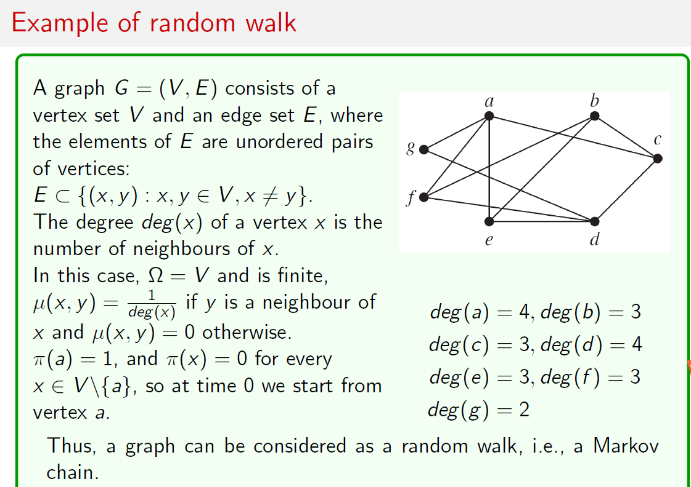
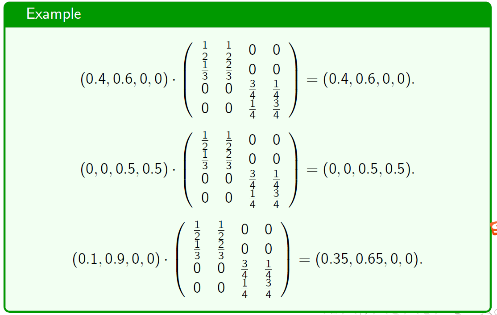
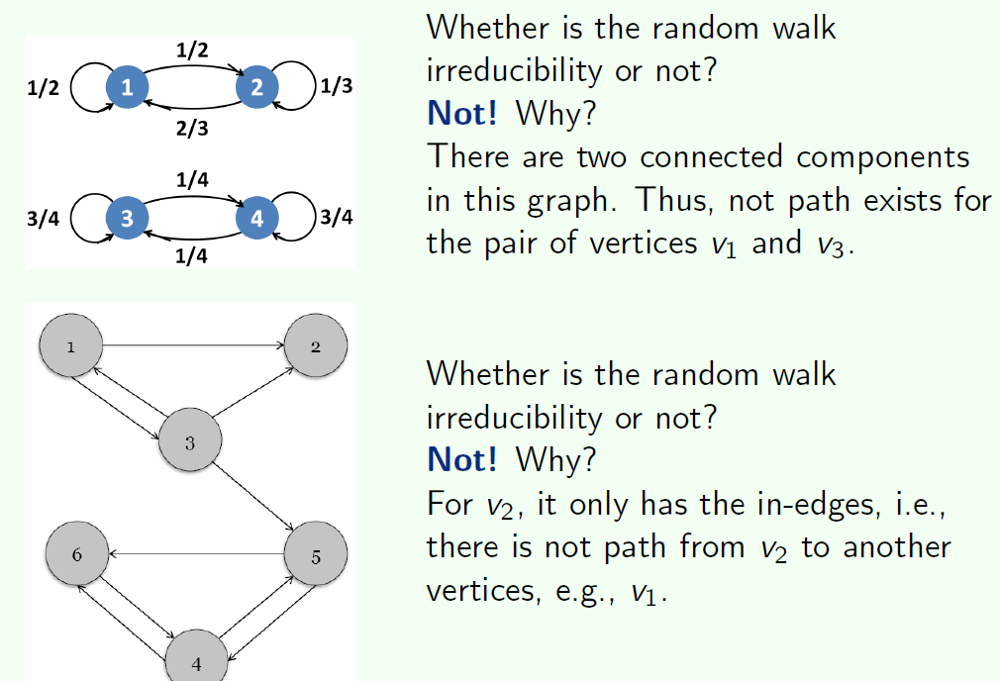

# 第七讲 随机游走 Random Walk

### 一、马尔科夫链和随机游走 

#### 1、随机过程

随机过程是时序集I和状态级S构成的
$$
I是index\space set，通常是时间，如Z^+,R或者R^+ \\
S是状态空间，如Z^+,R^n或者{a,b,c}
$$

#### 2、随机过程分类

I和S可以是离散集或连续集，以此分为四类

#### 3、马尔科夫性质——其中一类随机过程

当前状态只与前一个状态有关，一阶相关，即
$$
P(X(t_{n+1})=j_{n+1}\vert X(t_n)=j_n,…X(t_0)=j_0)=P(X(t_{n+1})=j_{n+1}\vert X(t_n)=j_n)
$$

- 满足马尔科夫性质的随机过程称为马尔科夫过程
- 马尔科夫过程没有记忆性。
- 基于这个性质，不是所有随机过程都可以使用马尔科夫过程建模，如文字处理。但可以增加相关阶数来近似真实过程

#### 4、离散时间马尔科夫链

- 一个离散时间，离散状态的随机过程$X_0,X_1,...$，满足马尔科夫性质称为马尔科夫链，

$$
P(X_{n+1}=x_{n+1}\vert X_n=x_n,…X_0=x_0)=P(X_{n+1}=x_{n+1}\vert X_n=x_n)
$$

- 时齐（time homogeneous）的马尔科夫链，如果满足马尔科夫链满足
  $$
  P(X_{s+t}\vert X_s=i)=P(X_t=j\vert X_0=i)
  $$
  即$P(X_{s+t}\vert X_s=i)$与s无关

- 若$P(X_{n+1}=j\vert X_{n}=i)=P_{ij}$与n无关，X称为时齐的马尔科夫链，后文均讨论时齐的马尔科夫链.

- 例子

  

#### 5、马尔科夫转移矩阵

- 定义：时间t的概率转移矩阵为$P^{(t+1)}_{n\times n}$,$P^{(t+1)}_{x,y}=P(X_{t+1}=y\vert X_t=x)$，描述一步转移的概率

- 当过程满足时齐性时，P与t无关。

- 满足性质：

$$
\sum_yP^{(t+1)}_{x,y}=\sum_yP(X_{t+1}=y\vert X_t=x)=\dfrac{\sum_yP(X_{t+1}=y,X_t=x)}{P(X_t=x)}=1\\即，行和为1
$$

#### 6、状态分布

- 设$\pi^{(t)}$为时刻t的状态分布，$\pi^{(t)}_x=P(X_t=x)$，满足$\sum_x\pi_x^{t}=1$

- $\pi^{(t+1)}=\pi^{(t)}P^{(t+1)}$

$$
\pi^{(t+1)}_y=\sum_xP(X_{t+1}=y\vert X_t=x)P(X_t=x)=\sum_x\pi^{(t)}_yP^{(t+1)}_{x,y}=(\pi^{(t)}P^{(t+1)})_{y}
$$

- 例子

- 平稳分布 Stationary distribution
  $$
  给定P，若\pi满足，\pi P=\pi，则P是一个平稳分布
  $$

- 不可约的马尔科夫链 Irreducibility

  - 定义：如果马尔科夫链的任意两个状态是互通的，则称这个马尔科夫链是不可归约的

  - 例子

    

#### 7、周期Period

- 定义：一个点的周期是到这个点的环的最大公约数。

- 周期的性质
  - 如果所有点都是互通的，则所有点的周期相同

#### 8、平稳分布的存在性

如果马尔科夫链是不可约的且反周期的，设其转移矩阵为P，$\lim_{n\rightarrow\infty}(P^{n})_{ij}=\pi_{ij}$
$$
\lim_{n\rightarrow\infty}P^{n}=\begin{bmatrix}
\pi(1) & \pi(2) & \dots & \pi(j) & \dots \\
\pi(1) & \pi(2) & \dots & \pi(j) & \dots \\
\dots & \dots & \dots & \dots & \dots \\
\pi(1) & \pi(2) & \dots & \pi(j) & \dots \\
\dots & \dots & \dots & \dots & \dots \\
\end{bmatrix}
$$

- 二分图一定没有平稳分布（因为周期为2），可以定义两步关系，使其变为不可归约的。
- 异构图一般没有平稳分布（如二分图）

### 二、Page Rank算法

#### 1、

定义概率转移矩阵$M=(M_{ij})\in R^{n\times n}$
$$
M_{ij}=\begin{cases}
\dfrac{1}{n_i},v_i\rightarrow v_j\\
0, 其他情况
\end{cases}
$$

   

