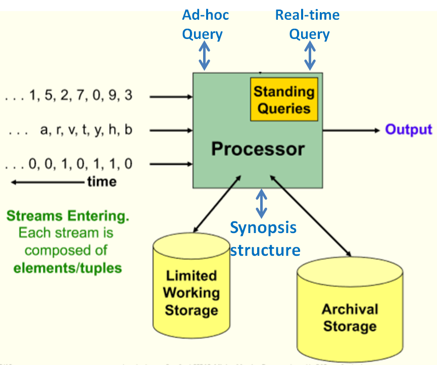

修改日期：2019-4-17

# 第三讲 Sketch for Data Streaming

### 一、流数据

##### 定义

一个序列$\sigma=<a_1,a_2,\dots,a_m,\dots>, a_m\in[n],a[n]:=\{1,2,\dots,n\}$

##### 特点

1. 持续性
2. 规模大
3. 速度快

##### 流数据算法的特点

1. 使用较小的空间处理流数据

2. 不能无限制的回看，往往只能查看刚刚过去的p个过去的数据（p是一个较小的正整数）

##### Sketch

所谓sketch指对数据的摘要，压缩，选取一个属性来概括整个流，比如计数，和，样本，最值等，对不同工作往往采用不同的sketch

##### 传统算法和流算法对比

|            |  传统算法  |      流算法      |
| :--------: | :--------: | :--------------: |
|    Type    | 有限，静态 | 无限，动态，高速 |
|  存储位置  |    硬盘    | 内存（空间有限） |
| efficiency |   非实时   |       实时       |
|   return   |    准确    |     模糊结果     |

##### 近似法与随机化 Approximation and randomization

- Approximation: 

  对于正确的值a，算法只会给出$a(1\pm\epsilon)$范围内的结果

- Randomization:

  以$1-\delta$概率成功给出正确结果

-  Approximation and Randomization

  $(\epsilon,\delta)$-approximations表示：以$1-\delta$概率成功给出$a(1\pm\epsilon)$范围内的结果

##### 用Approximation and randomization衡量一个算法的质量

​	设A($\sigma $)为算法A给出的结果，$\phi(\sigma)$为真实结果
$$
相对版本：P[\lVert A(\sigma)-\phi(\sigma) \rVert>\epsilon\phi(\sigma)]\le \delta\\
绝对版本：P[\lvert A(\sigma)-\phi(\sigma) \rvert>\epsilon]\le \delta
$$

##### 流数据模型

- 构架

### 二、流数据频率 Item frequencies

- 设一个流$\sigma=<a_1,a_2,\dots,a_m>,a_i\in[n]$,定义一个频率向量$f=(f_1,f_2,\dots,f_n)$,满足$\sum^n_{i=1}f_i=m$

- 问题：

  给一个参数k，输出集合${j: f_j\ge\frac{m}{k}}$,或者给一个参数$\psi$，输出集合$\{j: f_j>\psi m\}$

#### 1、确定性算法

#### $\psi$ -frequent items

设一个流$\sigma=<a_1,a_2,\dots,a_m>$，$a_i$取值1到n的正整数，即$a_i\in[n]$，记其中值i出现的频率为$f_i=\lvert\{j\lvert a_j=i\}\rvert$，$\psi$-frequent item由集合{$i\vert f_i>\psi m$}组成