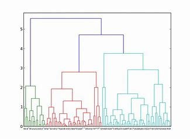

# 第八讲 Community Detection社团检测

### 常见图模型

全局社团结构：图中每个点都至少在一个社团里面

局部社团结构

好的社团：

最大化社团内部的链接，最小化社团间的链接，定义cut(A)，A为一个社团，则cut(A)表达一个社团向外链接的边的权重的的和。
$$
cut(A)=\sum_{i\in A,j\notin A}w_{ij}
$$
但计算复杂度为$O(VE^2)$，难以使用

- log-log scale:

$$
P(X=k)=ck^{\alpha}\\
logP=\alpha logk+logC\\
x是出度
$$

### NULL Model

- 直观描述：

  随机图，在给定节点中，在任意两个节点间以一个概率生成一条边，共生成m条边。其中第i个节点的出度的期望为$k_i$

- 符号描述

  定义随机变量$X_{ij}$。若$X_{ij}=1$，i，j节点之间有边。记$P[X_{ij}=1]=P_{ij}$。
  
  有
  $$
  \sum_{i,j}E(X_{ij})=\sum_{i,j}P_{ij}=2m
  $$
	
  $$
  \sum_jE(X_{ij})=\sum_jP_{ij}=k_i
  $$
  
- 模型推导
  
  $P_{ij}$的大小与$k_i,k_j$的大小有关，所以设$P_{ij}=f(k_i)f(k_j)$
  $$
    \because\sum_jP_{ij}=\sum_jf(k_i)f(k_j)=f(k_i)\sum_jf(k_j)=k_i
    且\sum_jf(k_j)与v_i无关\\
    \therefore 设f(k_i)=Ck_i\\
    \therefore\sum_{i,j}f(k_i)f(k_j)=C^2\sum_{i,j}k_ik_j=C^2(2m)^2=2m\\
    \therefore C^2=\dfrac{1}{2m}\\
    \therefore P_{ij}=f(k_i)f(k_j)=C^2k_ik_j=\dfrac{k_ik_j}{2m}
  $$

- 模型的二项解释

  - 设$X_i$为i.i.d，满足Bernoulli($\frac{k_i}{2m}$)。$X_i=1$表示$v_i$是边的起始点
  - 同理设$Y_i$是边的目标点
  - 设$Z_{ij}=1$，当$v_i,v_j$之间存在边时。

  在插入m条边之后（无向图一条边算两次，所以是2m），有$\sum_{k=1}^{2m}Z_{ij}^{(k)}$~$Binom(2m,p)$
  $$
  p=P(Z_{ij}=1)=P(X_i=1,Y_j=1)=P(X_i=1)P(Y_j=1)=\dfrac{k_i}{2m}\dfrac{k_j}{2m}
  $$

  $$
  \therefore E(\sum_{k}Z_{i,j}^{(k)})=2mP(Z_{ij}=1)=\dfrac{k_ik_j}{2m}
  $$

### Modularity 模块度

##### 定义

- Modularity是衡量网络或图**结构化程度**的量
- 给定一个无向图$G=(V,E)$，和它的邻接矩阵A，我们可以定义Modularity为

$$
Q=\dfrac{1}{2m}\sum_{i,j}(A_{ij}-\dfrac{k_ik_j}{2m})\delta(C_i,C_j)\\
m指边数，C_i指第i个点落在哪个community，k_i指v_i的度数\\
\delta(C_i,C_j)=\begin{cases}
1,C_i,C_j在同一个Community\\
0，其他
\end{cases}
$$

- 例子

  

- 对(8)式的理解：

  - Q越大，图G的结构化越好。所以Modularity用来评估社团的质量
  - (8)式中减去的$\dfrac{k_ik_j}{2m}$表达的是图中随机产生边，$v_i,v_j$之间有边的概率。所以随机情况下两个点之间越不可能产生边的时候，两点间存在边，它带来的"信息"就越大

  - Modularity可以看做对真实的图G和NULL模型生成图区别的一个打分

  - $Q\in[-1,1]$

  - Q可以改写为
    $$
    Q=\dfrac{1}{2m}\sum_{c\in C}\sum_{i\in c}\sum_{j\in c}(A_{ij}-\dfrac{k_ik_j}{2m})
    $$
    

##### 有权图上的Modularity

将原来的邻接矩阵用权重矩阵替代
$$
W_{ij}=\begin{cases}w_{ij},\ A_{ij}=1\\0,\ otherwise
\end{cases}
$$

$$
Q=\dfrac{1}{2m}\sum_{i,j}(W_{ij}-\dfrac{w_iw_j}{2m})\delta(C_i,C_j)
$$

##### 有向图上的Modularity

$$
Q=\dfrac{1}{m}\sum_{i,j}(A_{ij}-\dfrac{k_{i}^{out}k_j^{in}}{m})\delta(C_1,C_2)
$$

### Modularity 矩阵

##### 只包含两个社团的图

- 符号定义

  - 设网络中有n个节点
  - $s_i=\begin{cases} 1, 节点i属于第一个社团\\ -1，节点i属于第二个社团\end{cases}$

- Modularity可重写为
  $$
  Q=\dfrac{1}{2m}\sum_{i,j}(A_{ij}-\dfrac{k_ik_j}{2m})(\dfrac{1}{2}(s_is_j+1))\\
  =\dfrac{1}{4m}\sum_{i,j}(A_{ij}-\dfrac{k_ik_j}{2m})(s_is_j+1)\\
  =\dfrac{1}{4m}\sum_{i,j}(A_{ij}-\dfrac{k_ik_j}{2m})s_is_j
  =\dfrac{1}{4m}s^TBs\\
  其中B_{ij}=A_{ij}-\dfrac{k_ik_j}{2m},\\
  \sum_{i,j}(A_{ij}-\dfrac{k_ik_j}{2m})=\sum_{i,j}A_{ij}-\sum_{i,j}\dfrac{k_ik_j}{2m}=
\sum_{i,j}A_{ij}-\sum_{i}\dfrac{k_i}{2m}\sum_{j}k_j=2m-2m=0
  $$
  
- B就称为Modularity矩阵

##### 划分社团

- 观察到B的行和，列和为0，所以它有特征向量$(1,\cdots,1)$以及对应的特征值0，所以可以使用

spectral partitioning的方法

- 将s分解为$s=\sum^n_{i=1}=a_iu_i$，$a_i=u_i^Ts$,$u_i$是归一化，正交向量组
  $$
  Q=\dfrac{1}{4m}\sum_ia_iu_i^TB\sum_ja_ju_j=\dfrac{1}{4m}\sum_j^n(u_i^Ts)^2\beta_i
  $$
  $\beta_i$是B对应特征向量的特征值。$\beta_1\ge\beta_2\ge\cdots\ge\beta_n$
  
  
  
- 所以为了更高的模块化，可以选择合适的s，最大化Q。理想情况下，选择s平行于$u_i$显然是最好的选择。但由于s的分量取值只能是1或-1，所以往往不能找到与$u_1$平行的向量s。所以一个妥协的s的取值方法是
  $$
  s_i=\begin{cases}1,u_{1i}>0\\-1,otherwise\end{cases}
  $$
  
##### 多社团划分

- 连续进行上述过程，进行二划分

- 上述过程的正确需要，$\Delta Q>0$

#### Louvain method

##### 算法分析

- 速度快，只与第一遍的复杂度相关，时间复杂度为$O(\lvert E\rvert)$
- 无超参数
- 可以衡量划分质量，作为一种度量衡量其他算法的优劣
- 给出的社团结构是层次状的

##### 缺陷

- 当真实社团结构很小时，算法可能找不出来。因为算法倾向于将小社团合并到大社团中